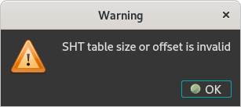

# Lights Out

## Task outline

```
Unfortunately, the incident response team informed us about
further unknown activity on another air-gapped device. They
found mysterious files on the host, but they were unable to
analyze the samples. We need you to find out what they were
used for.

https://adversary.quest/files/d292146ce995da4edf968b401f23a9a0/LightsOut.tar.gz

```


Inside the archive we have three files:
```
drwxr-xr-x adversaryquest/adversaryquest 0 2022-06-16 03:00 LightsOut/
-rwxr-xr-x adversaryquest/adversaryquest 5564 2022-06-16 03:00 LightsOut/i
-rwxr-xr-x adversaryquest/adversaryquest 8772 2022-06-16 03:00 LightsOut/lds
-rwxr-xr-x adversaryquest/adversaryquest   20 2022-06-16 03:00 LightsOut/Font-Unix

$ file *
Font-Unix: data
i:         ELF 32-bit LSB executable, ARM, EABI5 version 1 (SYSV), dynamically linked, interpreter /lib/ld-linux-armhf.so.3, missing section headers
lds:       ELF 32-bit LSB executable, ARM, EABI5 version 1 (SYSV), dynamically linked, interpreter /lib/ld-linux-armhf.so.3, BuildID[sha1]=149cba1150c097a6784e9f32bf7954f9109d75ba, for GNU/Linux 3.2.0, not stripped
```


- the `lds` binary is not really needed for this challenge. 
- `Font-Unix` contains some binary data that we probably need to decrypt:

```
$ hexdump  -Cv Font-Unix 
00000000  f2 6b f6 a7 8d 18 c2 2c  33 12 19 d6 4c d2 18 c4  |.k.....,3...L...|
00000010  1a d7 34 18                                       |..4.|
```
- the `i` binary seems to use or create `Font-Unix`:

```
$ strings i 
/lib/ld-linux-armhf.so.3
abort
__libc_start_main
libc.so.6
GLIBC_2.4
__gmon_start__
0B!O
F(FQF
$1R@
/mnt/git-infrastructure/network-services.password
/usr/bin/lds
/tmp/.Font-Unix
GCC: (Raspbian 10.2.1-6+rpi1) 10.2.1 20210110
aeabi
```


## Initial reversing attempt

Of course, we open up the binary in IDA to understand what it does but already some issues become apparent as hinted by the output from the `file` command above.



We can ignore this error for now. Let's get a general feel for the binary. 


Initial layout: tiny binary, compiled with gcc, should not be much code to it. Looks like only two functions are user-code: `main` and `sub_10484`.


The `main` function looks a bit odd even from the disassembly view. Could it be due to the SHT error above? Decompilation is even worse:


Maybe we can assume that `sub_10484` does some shenanigans and does not return? But we already saw its disassembly previously and IDA should have covered this case. Let's check the decompilation just to be sure:


OK, from a high-level it is not immediately clear what the obfuscation "trick" is. The sure-fire approach would be to take the disassembly in order and read it "line-by-line" until it clicks.
But we can do better by seeing what happens from a dynamic perspective

## Mini dynamic analysis using QEMU


It should be possible to run the binary under QEMU and obtain some further insight:
```
$ qemu-arm ./i
arm-binfmt-P: Could not open '/lib/ld-linux-armhf.so.3': No such file or directory
$ apt-file search ld-linux-armhf.so
libc6-armhf-cross: /usr/arm-linux-gnueabihf/lib/ld-linux-armhf.so.3
$ qemu-arm -h
usage: qemu-arm [options] program [arguments...]
Linux CPU emulator (compiled for arm emulation)

Options and associated environment variables:

Argument             Env-variable      Description
-h                                     print this help
-help                                  
-g port              QEMU_GDB          wait gdb connection to 'port'
-L path              QEMU_LD_PREFIX    set the elf interpreter prefix to 'path'
...

$ qemu-arm -L /usr/arm-linux-gnueabihf ./i
qemu: uncaught target signal 11 (Segmentation fault) - core dumped
Segmentation fault

```

So far so good. Now it runs but it crashes. Let's see how it interacts with the OS and maybe even figure out why it crashes by using system call tracing:


```
$ qemu-arm -L /usr/arm-linux-gnueabihf -strace ./i
2182799 brk(NULL) = 0x00022000
...
2182799 open("/mnt/git-infrastructure/network-services.password",O_RDONLY) = -1 errno=2 (No such file or directory)
2182799 read(-2,0x21034,1024) = -1 errno=9 (Bad file descriptor)
2182799 close(-2) = -1 errno=9 (Bad file descriptor)
2182799 open("/tmp/.Font-Unix",O_RDWR|O_CREAT,0700) = 3
2182799 write(3,0x21034,1) = 1
2182799 write(3,0x21035,1) = 1
2182799 write(3,0x21036,1) = 1
2182799 write(3,0x21037,1) = 1
2182799 write(3,0x21038,1) = 1
...
2182799 write(3,0x21ffe,1) = 1
2182799 write(3,0x21fff,1) = 1
--- SIGSEGV {si_signo=SIGSEGV, si_code=1, si_addr=0x00022000} ---
qemu: uncaught target signal 11 (Segmentation fault) - core dumped
Segmentation fault

```

Alright, so the heap is extended until 0x22000 by the loader and because it doesn't find `/mnt/git-infrastructure/network-services.password` the logic breaks down a bit.

But we did not see the `open` syscalls for the two files, only their strings and there are no xreferences in IDA. At least it seems that when run, it (mostly) works.

Now it's time to use another trick from the QEMU toolbox: instruction tracing.

```
$ qemu-arm -h
usage: qemu-arm [options] program [arguments...]
Linux CPU emulator (compiled for arm emulation)

Options and associated environment variables:

Argument             Env-variable      Description
-h                                     print this help
-help                                  
...
-d item[,...]        QEMU_LOG          enable logging of specified items (use '-d help' for a list of items)
...
-D logfile           QEMU_LOG_FILENAME write logs to 'logfile' (default stderr)

$ qemu-arm -d help
Log items (comma separated):
out_asm         show generated host assembly code for each compiled TB
in_asm          show target assembly code for each compiled TB
...
```

We are going to be using `in_asm` as we want to map the original execution flow that somehow gets obfuscated in IDA.
Let's see what gets executed after `libc_start_main` calls `main` at 0x103d0:

```
$ qemu-arm -L /usr/arm-linux-gnueabihf -d in_asm  -D in_asm.log ./i
qemu: uncaught target signal 11 (Segmentation fault) - core dumped
Segmentation fault
$ cat in_asm.log | grep 103d0 -A30
0x000103d0:  e52db004  str      fp, [sp, #-4]!
0x000103d4:  e28db000  add      fp, sp, #0
0x000103d8:  e24dd00c  sub      sp, sp, #0xc
0x000103dc:  e50b0008  str      r0, [fp, #-8]
0x000103e0:  e50b100c  str      r1, [fp, #-0xc]
0x000103e4:  e1a0700f  mov      r7, pc
0x000103e8:  eb000025  bl       #0x10484

----------------
IN: 
0x00010484:  e1a05811  lsl      r5, r1, r8
0x00010488:  e0255002  eor      r5, r5, r2
0x0001048c:  e28550f9  add      r5, r5, #0xf9
0x00010490:  e20550ff  and      r5, r5, #0xff
0x00010494:  e0877005  add      r7, r7, r5
0x00010498:  e1a0800f  mov      r8, pc
0x0001049c:  e12fff17  bx       r7

----------------
IN: 
0x000103ec:  4640       mov      r0, r8
0x000103ee:  2100       movs     r1, #0
0x000103f0:  2705       movs     r7, #5
0x000103f2:  df05       svc      #5

----------------
IN: 
0x000103f4:  4605       mov      r5, r0
0x000103f6:  f44f 7a04  mov.w    sl, #0x210
0x000103fa:  ea4f 2a0a  lsl.w    sl, sl, #8
0x000103fe:  f10a 0a34  add.w    sl, sl, #0x34

```

As expected from the disassembly, `main` calls `sub_10484`. But when this function returns to 0x103ec something happens. We should have seen the following according to IDA:

```
LOAD:000103EC                 TSTCS           R0, R0,ASR#12
LOAD:000103F0                 SVCLE           0x52705
LOAD:000103F4                 VST1.8          {D20-D22}, [PC],R5
LOAD:000103F8                 B               0x13EEC10
```


## IDA Feng Shui
Ok, it seems we've stumbled upon the obfuscation mechanism: there is a code type switch from ARM to Thumb. Let's "help" IDA make the code pretty by supplying this information.
We can do this by changing the T segment register value from 0 to 1. It is possible to use Alt-G to do this manually, but if you want to set a longer region the API is better at this. See the bottom console window input:


After:


Much better, now we need to tell IDA that main does not end at 0x103FA by clicking the next instruction, at 0x103FE, and selecting `Edit`/`Functions`/`Append function tail`, then `main`.
Here's what it looks like now.


Not great, not terrible. It looks a bit better but we still don't see clearly what the code does due to the inline SVC instructions. What do these do exactly? Syscalls!

Checking `https://arm.syscall.sh/` we can see that the syscalls correspond to:
 - `svc 5` - open
 - `svc 3` - read
 - `svc 6` - close
 - `svc 5` - open
 - `svc 0xB` - execve

Can we further inform IDA about these syscalls? Yes, but we need to be careful. Ideally, we would want to have them show up, for example, as `open(pathname, flags,mode);` instead of `svc 5`.
From the site mentioned above we know the calling convention is:
 - syscall number in r7
 - return value in r0
 - arg0 in r0, arg1 in r1, etc

So if instead of the instruction at 0x103F2 `svc 5` there was `call syscall_open` we could have used `__usercall` and manually set the function type declaration to:

```int __usercall syscall_open@<r0>(char *pathname@<r0>, int flags@<r1>, int mode@<r2>)```

Luckily, this can already be done in IDA through a somewhat obscure feature under `Edit`/`Other`/`Decompile as call`: 


Here's what that looks like after refreshing the decompilation view:


Now to do all the syscalls:
 - 0x103F2: `svc 5`: ```int __usercall syscall_open@<r0>(char *pathname@<r0>, int flags@<r1>, int mode@<r2>)```
 - 0x1040A: `svc 3`: ```int __usercall syscall_read@<r0>(int fd@<r0>, char *buf@<r1>, int count@<r2>)```
 - 0x10412: `svc 6`: ```int __usercall syscall_close@<r0>(int fd@<r0>)```
 - 0x10426: `svc 5`: ```int __usercall syscall_open@<r0>(char *pathname@<r0>, int flags@<r1>, int mode@<r2>)```
 - 0x10456: `svc 4`: ```int __usercall syscall_write@<r0>(int fd@<r0>, char *buf@<r1>, int count@<r2>)```
 - 0x1047E: `svc 0xB`: ```int __usercall __noreturn syscall_execve@<r0>(char *filename@<r0>, char **argv@<r1>, char **envp@<r2>)```


Almost legible now, right? But it seems that due to the initial trampoline to `sub_10484` the arguments to the first `open` show up as undefined.
We can fix that by merging the code from `sub_10484` into `main`

The original flow is:

```
LOAD:000103E4                 MOV             R7, PC
LOAD:000103E8                 BL              sub_10484

LOAD:00010484                 MOV             R5, R1,LSL R8
LOAD:00010488                 EOR             R5, R5, R2
LOAD:0001048C                 ADD             R5, R5, #0xF9
LOAD:00010490                 AND             R5, R5, #0xFF
LOAD:00010494                 ADD             R7, R7, R5
LOAD:00010498                 MOV             R8, PC
LOAD:0001049C                 BX              R7

LOAD:000103EC                 MOV             R0, R8
...

```

We need to do the following:
 - patch 000103E8 to `B 0x10484`
 - go to sub_10484 and `Edit`/`Functions`/`Delete function`
 - also `Edit`/`Functions`/`Append function tail` to main
 - patch 0001049C to `B 0x103EC` 


Here's what this accomplishes:


Looking awesome but the most important part is still missing.
We can clearly see a loop in the disassembly but for some reason it doesn't show up in the decompilation so we still don't understand how the encryption of the input bytes takes place.


I assume this is some sort of limitation in IDA treating the `IT HI` instruction although I'm not entirely sure. In any case, we can use an alternate branching idiom by:

- patching 00010462 to `BEQ 0x10434`
- patching 00010464 to `NOP`


## Decryption

At this point it is perfectly clear how the encryption takes place. Even though it's straightforward to reverse it at this point, we can simply perform a full search for every byte.


```python
#!/usr/bin/python
target = bytearray.fromhex("f2 6b f6 a7 8d 18 c2 2c  33 12 19 d6 4c d2 18 c4 1a d7 34 18")

def do_encrypt(buf):
    buf = bytearray(buf)

    input_size = len(buf)

    acc = input_size ^ 0xA5

    for i in range(input_size):
        tmp = buf[i] ^ acc
        buf[i] = tmp
        acc = ((4 * acc) ^ tmp) + 2
        acc &= 0xFF

    return buf

prefix = b''

while len(prefix) != len(target):

    for i in range(256):
        candidate = bytearray(prefix)
        candidate.append(i)
        l = len(candidate)

        #encryption depends on total size, need to pad it
        candidate = candidate.ljust(len(target), b'\x00')

        cur = do_encrypt(candidate)
        if cur[:l] == target[:l]:
            print(candidate)
            prefix = candidate[:l]
            break
```

```
$ python sim.py
bytearray(b'C\x00\x00\x00\x00\x00\x00\x00\x00\x00\x00\x00\x00\x00\x00\x00\x00\x00\x00\x00')
bytearray(b'CS\x00\x00\x00\x00\x00\x00\x00\x00\x00\x00\x00\x00\x00\x00\x00\x00\x00\x00')
bytearray(b'CS{\x00\x00\x00\x00\x00\x00\x00\x00\x00\x00\x00\x00\x00\x00\x00\x00\x00')
bytearray(b'CS{c\x00\x00\x00\x00\x00\x00\x00\x00\x00\x00\x00\x00\x00\x00\x00\x00')
bytearray(b'CS{c4\x00\x00\x00\x00\x00\x00\x00\x00\x00\x00\x00\x00\x00\x00\x00')
bytearray(b'CS{c4s\x00\x00\x00\x00\x00\x00\x00\x00\x00\x00\x00\x00\x00\x00')
bytearray(b'CS{c4st\x00\x00\x00\x00\x00\x00\x00\x00\x00\x00\x00\x00\x00')
bytearray(b'CS{c4st0\x00\x00\x00\x00\x00\x00\x00\x00\x00\x00\x00\x00')
bytearray(b'CS{c4st0m\x00\x00\x00\x00\x00\x00\x00\x00\x00\x00\x00')
bytearray(b'CS{c4st0m_\x00\x00\x00\x00\x00\x00\x00\x00\x00\x00')
bytearray(b'CS{c4st0m_1\x00\x00\x00\x00\x00\x00\x00\x00\x00')
bytearray(b'CS{c4st0m_1m\x00\x00\x00\x00\x00\x00\x00\x00')
bytearray(b'CS{c4st0m_1mp\x00\x00\x00\x00\x00\x00\x00')
bytearray(b'CS{c4st0m_1mpl\x00\x00\x00\x00\x00\x00')
bytearray(b'CS{c4st0m_1mpl4\x00\x00\x00\x00\x00')
bytearray(b'CS{c4st0m_1mpl4n\x00\x00\x00\x00')
bytearray(b'CS{c4st0m_1mpl4nt\x00\x00\x00')
bytearray(b'CS{c4st0m_1mpl4nts\x00\x00')
bytearray(b'CS{c4st0m_1mpl4nts}\x00')
bytearray(b'CS{c4st0m_1mpl4nts}\n')
```

As you can probably realize by now, there was a huge shortcut opportunity if we applied the approach above but using the original binary, treating it as a black-box.


